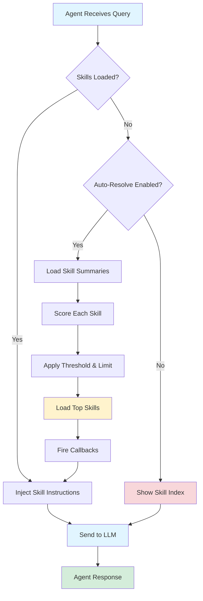

# Agent Skills System Tutorial

## Table of Contents

1. [Introduction](#introduction)
2. [What are Agent Skills?](#what-are-agent-skills)
3. [Skills Resolution Flow](#skills-resolution-flow)
4. [Basic Usage - Manual Skill Loading](#basic-usage---manual-skill-loading)
5. [Auto-Resolution - Automatic Skill Discovery](#auto-resolution---automatic-skill-discovery)
6. [Creating Custom Skills](#creating-custom-skills)
7. [Progressive Disclosure](#progressive-disclosure)
8. [Streaming with Skills](#streaming-with-skills)
9. [Advanced Patterns](#advanced-patterns)
10. [Troubleshooting](#troubleshooting)
11. [Next Steps](#next-steps)

---

## Introduction

The Agent Skills System brings dynamic, context-aware instruction loading to Laragentic agents. Following the [agentskills.io](https://agentskills.io) specification, this system allows agents to load specialized knowledge and capabilities on-demand, minimizing context usage while maximizing agent effectiveness.

### Key Benefits

✅ **Progressive Disclosure**: Load only what you need, when you need it
✅ **Modular Knowledge**: Organize specialized instructions into reusable skills
✅ **Auto-Discovery**: Agents automatically find relevant skills for tasks
✅ **Context Efficiency**: Reduce token usage with targeted skill loading
✅ **Easy Sharing**: Share skills across teams and projects

---

## What are Agent Skills?

An Agent Skill is a self-contained package of specialized instructions and resources that teaches an agent how to perform a specific task exceptionally well.

### Skill Structure

Each skill is a directory containing:

```
skill-name/
├── SKILL.md          # Required: Metadata + instructions
├── scripts/          # Optional: Executable scripts
├── references/       # Optional: Reference documents
└── assets/           # Optional: Images, diagrams, etc.
```

### SKILL.md Format

```markdown
---
name: skill-name
description: What this skill does
tags: [tag1, tag2, tag3]
version: 1.0.0
author: Your Name
---

# Skill Title

Detailed instructions for the agent on how to use this skill...
```

The YAML frontmatter provides metadata for skill discovery and resolution, while the markdown content contains the actual instructions the agent will follow.

---

## Skills Resolution Flow



### Resolution Process

1. **Query Arrives**: Agent receives a user query
2. **Check Skills**: Are skills already loaded?
   - **Yes**: Inject their instructions into the prompt
   - **No**: Check if auto-resolution is enabled
3. **Auto-Resolution** (if enabled):
   - Load metadata summaries for all available skills
   - Score each skill's relevance to the query
   - Select top-scoring skills above threshold
   - Load full instructions for selected skills
4. **Manual Mode** (if not auto-resolving):
   - Show skill index (names + descriptions only)
   - Agent can request specific skills by name
5. **Prompt Enhancement**: Add skill instructions to base prompt
6. **LLM Call**: Send enhanced prompt to language model

---

## Basic Usage - Manual Skill Loading

### Step 1: Add the Trait

```php
use Laragentic\Skills\HasAgentSkills;

class MyAgent implements Agent, Conversational
{
    use Promptable, RemembersConversations, ReActLoop, HasAgentSkills;

    public function instructions(): string
    {
        return $this->enhanceInstructionsWithSkills(
            'You are a helpful assistant...',
            ''
        );
    }
}
```

### Step 2: Load Skills Manually

```php
// Load a single skill
$agent = new MyAgent;
$agent->withSkill('code-review');

// Load multiple skills
$agent->withSkills(['code-review', 'data-analysis']);

// Chain with other methods
$result = $agent
    ->withSkill('api-testing')
    ->maxIterations(5)
    ->reactLoop('Test the /users endpoint');
```

### Step 3: Use Skills with Loops

```php
// With ReActLoop
$result = (new MyAgent)
    ->withSkill('code-review')
    ->reactLoop('Review this PHP code for security issues: ...');

// With PlanExecuteLoop
$result = (new MyAgent)
    ->withSkill('data-analysis')
    ->planExecuteLoop('Analyze sales data and generate insights');

// With ChainOfThoughtLoop
$result = (new MyAgent)
    ->withSkill('code-review')
    ->chainOfThoughtLoop('What are potential security vulnerabilities?');
```

### What Happens?

When you load a skill:

1. The skill's SKILL.md file is parsed
2. Metadata and instructions are extracted
3. The skill is registered in the agent's skill registry
4. When the agent's instructions are built, skill content is injected
5. The LLM receives both base instructions and skill-specific guidance

---

## Auto-Resolution - Automatic Skill Discovery

Instead of manually specifying skills, let the agent automatically discover and load relevant skills based on the query.

### Enable Auto-Resolution

```php
$agent = new MyAgent;
$agent->autoResolveSkills(
    threshold: 0.3,  // Minimum relevance score (0.0 - 1.0)
    limit: 3         // Maximum skills to load
);

$result = $agent->reactLoop('Review this code for security issues');
// Automatically loads 'code-review' skill based on query content
```

### How Relevance Scoring Works

The resolver calculates a relevance score (0.0 - 1.0) for each skill:

- **Exact name match** in query: +1.0 score
- **Partial name match**: +0.5 score
- **Description keyword match**: +0.7 per matched keyword
- **Tag match**: +0.5 per matched tag

**Stop words** (the, and, or, etc.) and **short words** (< 3 chars) are filtered out.

### Example Scoring

Query: `"Analyze this dataset for trends and visualizations"`

```
data-analysis skill:
  - "analysis" in query matches "analysis" in description: +0.7
  - "data" in query matches "data" tag: +0.5
  - "visualization" in query matches "visualization" tag: +0.5
  Total: 1.7 (capped at 1.0)

code-review skill:
  - "code" not in query
  Total: 0.0

api-testing skill:
  - No matches
  Total: 0.0
```

Result: `data-analysis` skill is loaded.

### Tuning Auto-Resolution

```php
// More selective (higher threshold, fewer skills)
$agent->autoResolveSkills(threshold: 0.5, limit: 2);

// More inclusive (lower threshold, more skills)
$agent->autoResolveSkills(threshold: 0.2, limit: 5);

// Use config defaults
$agent->autoResolveSkills();
```

**Configuration** (`config/agentic.php`):

```php
'skills' => [
    'auto_resolve' => false,
    'resolution_threshold' => 0.3,
    'resolution_limit' => 3,
],
```

---

## Creating Custom Skills

### Step 1: Create Skill Directory

```bash
mkdir -p app/Skills/my-custom-skill
cd app/Skills/my-custom-skill
```

### Step 2: Write SKILL.md

```markdown
---
name: my-custom-skill
description: A brief description of what this skill does
tags: [relevant, tags, here]
version: 1.0.0
author: Your Name
---

# My Custom Skill

You are an expert in [domain]. Your task is to [specific task].

## Guidelines

1. [Guideline 1]
2. [Guideline 2]
3. [Guideline 3]

## Output Format

Provide your response in this structure:
- [Section 1]
- [Section 2]

## Best Practices

- [Practice 1]
- [Practice 2]
```

### Step 3: Add Optional Resources

```bash
# Scripts
mkdir scripts
echo '#!/bin/bash' > scripts/helper-script.sh
chmod +x scripts/helper-script.sh

# References
mkdir references
echo '# Reference Document' > references/guide.md

# Assets
mkdir assets
# Add images, diagrams, etc.
```

### Step 4: Use Your Skill

```php
$agent = new MyAgent;
$agent->withSkill('my-custom-skill');
// or
$agent->autoResolveSkills();
```

### Best Practices for Skill Creation

✅ **Be Specific**: Clear, focused instructions work better than vague guidelines
✅ **Use Examples**: Show the agent what good output looks like
✅ **Structure Output**: Define clear output formats
✅ **Include Context**: Explain when and why to use certain approaches
✅ **Add References**: Include checklists, tables, formulas
✅ **Test Thoroughly**: Test your skill with various queries
✅ **Version Control**: Track skill evolution with version numbers
✅ **Document Changes**: Maintain a changelog for skill updates

---

## Progressive Disclosure

The Skills System implements progressive disclosure to minimize context usage:

### Level 1: Skill Index (No Skills Loaded)

When no skills are loaded, the agent receives a **skill index** with just names and descriptions:

```
Available Skills:

**code-review**: Analyze code for security and performance
**data-analysis**: Analyze datasets and generate insights
**api-testing**: Test API endpoints and validate responses
```

Token usage: **Minimal** (just metadata)

### Level 2: Full Instructions (Skills Loaded)

When skills are loaded (manually or auto-resolved), full instructions are injected:

```
# Active Skills

## Skill: code-review

You are an expert code reviewer...
[Full detailed instructions]
[Scripts available: /path/to/scripts]
[References available: /path/to/references]
```

Token usage: **As needed** (only for loaded skills)

### Level 3: Resource Access (On Demand)

Scripts and references are loaded only when the agent explicitly requests them:

```php
$agent->onSkillLoaded(function ($skill) {
    if ($skill->hasScripts()) {
        $scripts = scandir($skill->scriptsPath);
        // Agent can now access script files
    }
});
```

Token usage: **Minimal** (loaded only when used)

---

## Streaming with Skills

Skills work seamlessly with streaming responses:

```php
use Laravel\Ai\Events\StreamedEvent;

$agent = (new MyAgent)
    ->autoResolveSkills()
    ->onSkillLoaded(function ($skill) {
        // Fires when skill is auto-loaded
        broadcast(new SkillActivated($skill->name()));
    })
    ->onSkillResolved(function ($skills, $query) {
        // Fires when auto-resolution completes
        $names = array_map(fn($s) => $s->name(), $skills);
        broadcast(new SkillsResolved($names));
    });

// Stream the response
foreach ($agent->reactLoopStream('Analyze this data...') as $event) {
    // Real-time skill activation and execution
    echo $event;
}
```

### Streaming Example with HTTP

```php
Route::get('/agent/stream', function () {
    $agent = (new MyAgent)
        ->autoResolveSkills()
        ->onSkillLoaded(function ($skill) {
            yield new StreamedEvent('skill-loaded', [
                'skill' => $skill->name()
            ]);
        });

    return response()->eventStream(function () use ($agent) {
        yield from $agent->reactLoopStream(
            request('query')
        );
    });
});
```

---

## Advanced Patterns

### Pattern 1: Conditional Skill Loading

```php
class SmartAgent
{
    public function handle(string $query)
    {
        $agent = new MyAgent;

        // Load skills based on query analysis
        if (str_contains(strtolower($query), 'security')) {
            $agent->withSkill('code-review');
        }

        if (str_contains(strtolower($query), 'data')) {
            $agent->withSkill('data-analysis');
        }

        return $agent->reactLoop($query);
    }
}
```

### Pattern 2: Skill Chaining

```php
// First pass: Code review
$review = (new MyAgent)
    ->withSkill('code-review')
    ->reactLoop('Review this code');

// Second pass: If issues found, use another skill
if ($review->response->text contains 'security issues') {
    $detailed = (new MyAgent)
        ->withSkill('security-audit')
        ->reactLoop('Detailed security audit: ' . $code);
}
```

### Pattern 3: Multi-Skill Workflows

```php
$agent = (new MyAgent)
    ->withSkills(['code-review', 'api-testing', 'data-analysis'])
    ->planExecuteLoop('
        1. Review the codebase for issues
        2. Test the API endpoints
        3. Analyze the test results
    ');
```

### Pattern 4: Custom Resolution Logic

```php
class CustomSkillAgent
{
    use HasAgentSkills;

    protected function resolveSkillsForQuery(string $query): void
    {
        // Custom resolution logic
        if ($this->requiresDeepAnalysis($query)) {
            $this->withSkills(['code-review', 'security-audit']);
        } else {
            parent::resolveSkillsForQuery($query);
        }
    }

    private function requiresDeepAnalysis(string $query): bool
    {
        return str_contains($query, 'critical')
            || str_contains($query, 'production');
    }
}
```

### Pattern 5: Skill Callbacks for Logging

```php
$agent = (new MyAgent)
    ->autoResolveSkills()
    ->onSkillLoaded(function ($skill) {
        Log::info('Skill activated', [
            'skill' => $skill->name(),
            'version' => $skill->metadata->version,
        ]);
    })
    ->onSkillResolved(function ($skills, $query) {
        Log::info('Skills resolved', [
            'query' => $query,
            'skills' => array_map(fn($s) => $s->name(), $skills),
        ]);
    });
```

---

## Troubleshooting

### Issue: Skill Not Found

**Problem**: `SkillNotFoundException: Skill 'xyz' is not registered`

**Solutions**:
1. Check skill directory exists: `app/Skills/xyz/`
2. Verify SKILL.md file exists
3. Check config path: `config('agentic.skills.path')`
4. Ensure proper directory permissions

### Issue: Skills Not Auto-Resolving

**Problem**: Auto-resolution doesn't load any skills

**Solutions**:
1. Verify auto-resolution is enabled: `$agent->autoResolveSkills()`
2. Lower threshold: `$agent->autoResolveSkills(threshold: 0.1)`
3. Check skill tags and descriptions match query keywords
4. Add more descriptive tags to skills

### Issue: Too Many Skills Loaded

**Problem**: Auto-resolution loads too many irrelevant skills

**Solutions**:
1. Raise threshold: `$agent->autoResolveSkills(threshold: 0.5)`
2. Lower limit: `$agent->autoResolveSkills(limit: 2)`
3. Make skill descriptions more specific
4. Use more targeted tags

### Issue: Invalid SKILL.md Format

**Problem**: `SkillValidationException: Frontmatter must have closing delimiter`

**Solutions**:
1. Ensure YAML frontmatter starts with `---`
2. Ensure YAML frontmatter ends with `---`
3. Check for syntax errors in YAML
4. Validate required fields: `name`, `description`

### Issue: Skills Not Appearing in Instructions

**Problem**: Skills are loaded but not in agent's prompt

**Solutions**:
1. Ensure `instructions()` method calls `enhanceInstructionsWithSkills()`
2. Check skill actually loaded: `$agent->loadedSkills()`
3. Verify skill registry: `$agent->skillRegistry()->all()`

### Debugging Tips

```php
// Check which skills are available
$loader = new SkillLoader(config('agentic.skills.path'));
$available = $loader->discover();
dump($available);

// Check loaded skills
$agent = new MyAgent;
$agent->withSkill('code-review');
dump($agent->loadedSkills());

// Check skill resolution
$resolver = new SkillResolver;
$score = $resolver->calculateRelevance(
    summary: ['name' => 'code-review', 'description' => '...', 'tags' => []],
    query: 'your query here'
);
dump($score);

// Inspect full instructions
$agent = new MyAgent;
$agent->withSkill('code-review');
dump($agent->instructions());
```

---

## Next Steps

### Explore More

- **ReAct Loop Tutorial**: Learn how skills enhance the reasoning-action loop
- **Plan-Execute Tutorial**: Use skills in planning workflows
- **Chain of Thought Tutorial**: Combine skills with iterative reasoning
- **Custom Loop Creation**: Build your own loop with skills support

### Contribute Skills

Share your skills with the community:

1. Create a skill for your domain
2. Test thoroughly with various queries
3. Document usage and examples
4. Submit to the Laragentic skills repository

### Advanced Topics

- **Skill Versioning**: Managing skill updates and compatibility
- **Skill Dependencies**: Skills that require other skills
- **Skill Composition**: Combining multiple skills into meta-skills
- **Dynamic Skill Generation**: Creating skills on-the-fly
- **Skill Marketplaces**: Discovering and sharing skills

---

## Resources

- **agentskills.io Specification**: https://agentskills.io
- **Example Skills**: `examples/skills/` directory
- **API Reference**: Detailed API documentation
- **Community**: Join the Laragentic community

---

**Happy Skill Building! 🚀**
