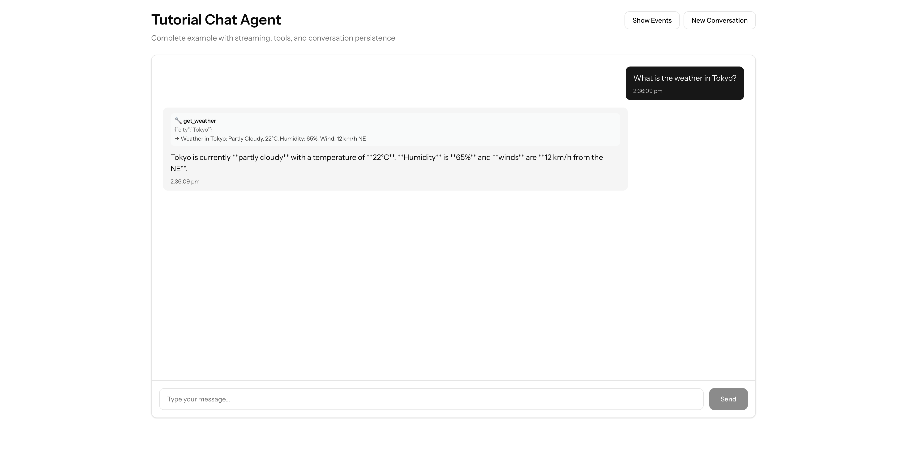

# Complete Working Example

A full-stack chat agent with streaming, tools, and conversation persistence using Laragentic.



## What You'll Build

A conversational AI agent that:

- **Streams responses in real-time** using Server-Sent Events (SSE)
- **Uses multiple tools** to answer questions (weather, search, calculator)
- **Maintains conversation context** across multiple messages
- **Shows real-time progress** as the agent thinks and acts
- **Has a beautiful React UI** for the chat interface

## Prerequisites

- Laravel 12.x or higher
- PHP 8.2 or higher
- Composer
- Node.js & npm (for frontend)
- An AI provider API key (OpenAI, Anthropic, or Gemini)

## Installation

### 1. Install Laragentic

```bash
composer require laragentic/agents
```

### 2. Install Laravel AI SDK (if not already installed)

```bash
composer require laravel/ai
```

### 3. Configure AI Provider

Add your API key to `.env`:

```env
# Choose one provider
OPENAI_API_KEY=sk-...
# OR
ANTHROPIC_API_KEY=sk-ant-...
# OR
GEMINI_API_KEY=...
```

Configure the provider in `config/ai.php`:

```php
return [
    'default' => 'openai', // or 'anthropic', 'gemini'

    'drivers' => [
        'openai' => [
            'key' => env('OPENAI_API_KEY'),
            'model' => 'gpt-4o', // Latest model
        ],

        'anthropic' => [
            'key' => env('ANTHROPIC_API_KEY'),
            'model' => 'claude-opus-4-6', // Latest model
        ],

        'gemini' => [
            'key' => env('GEMINI_API_KEY'),
            'model' => 'gemini-3-pro', // Latest model
        ],
    ],
];
```

### 4. Install Frontend Dependencies

```bash
npm install @laravel/stream-react
```

## Backend Implementation

### Step 1: Create Tools

Create three tools for the agent to use.

#### WeatherTool.php

```php
<?php

namespace App\Tools;

use Illuminate\Contracts\JsonSchema\JsonSchema;
use Laravel\Ai\Contracts\Tool;
use Laravel\Ai\Tools\Request;
use Stringable;

class WeatherTool implements Tool
{
    public function name(): string
    {
        return 'get_weather';
    }

    public function description(): Stringable|string
    {
        return 'Get the current weather conditions for a given city. Returns temperature, conditions, humidity, and wind speed.';
    }

    public function handle(Request $request): Stringable|string
    {
        $city = $request['city'] ?? 'Unknown';

        // Mock weather data for demo purposes
        $cities = [
            'tokyo' => ['temp' => 22, 'condition' => 'Partly Cloudy', 'humidity' => 65, 'wind' => '12 km/h NE'],
            'london' => ['temp' => 14, 'condition' => 'Rainy', 'humidity' => 85, 'wind' => '20 km/h SW'],
            'new york' => ['temp' => 18, 'condition' => 'Sunny', 'humidity' => 50, 'wind' => '8 km/h W'],
            'paris' => ['temp' => 16, 'condition' => 'Overcast', 'humidity' => 72, 'wind' => '15 km/h N'],
            'sydney' => ['temp' => 26, 'condition' => 'Clear', 'humidity' => 55, 'wind' => '10 km/h SE'],
        ];

        $key = strtolower(trim($city));
        $data = $cities[$key] ?? [
            'temp' => rand(10, 30),
            'condition' => ['Sunny', 'Cloudy', 'Rainy', 'Partly Cloudy', 'Clear'][array_rand(['Sunny', 'Cloudy', 'Rainy', 'Partly Cloudy', 'Clear'])],
            'humidity' => rand(30, 90),
            'wind' => rand(5, 25).' km/h',
        ];

        return "Weather in {$city}: {$data['condition']}, {$data['temp']}°C, Humidity: {$data['humidity']}%, Wind: {$data['wind']}";
    }

    public function schema(JsonSchema $schema): array
    {
        return [
            'city' => $schema->string()
                ->description('The city name to get weather for, e.g. "Tokyo", "London"')
                ->required(),
        ];
    }
}
```

#### SearchTool.php

```php
<?php

namespace App\Tools;

use Illuminate\Contracts\JsonSchema\JsonSchema;
use Laravel\Ai\Contracts\Tool;
use Laravel\Ai\Tools\Request;
use Stringable;

class SearchTool implements Tool
{
    public function name(): string
    {
        return 'search';
    }

    public function description(): Stringable|string
    {
        return 'Search for factual information on a topic. Returns a summary of search results.';
    }

    public function handle(Request $request): Stringable|string
    {
        $query = $request['query'] ?? '';

        // Mock search results for demo purposes
        $topics = [
            'laravel' => 'Laravel is a PHP web application framework created by Taylor Otwell. The latest version is Laravel 12.x (2026), featuring the AI SDK, improved performance, and modern PHP 8.2+ support.',
            'react' => 'React is a JavaScript library for building user interfaces, maintained by Meta. React 19 (2025) introduced Server Components and improved streaming support.',
            'ai' => 'Artificial Intelligence in 2026: Major advances include Claude Opus 4.6, GPT-5.2, and Gemini 3 Pro. Agentic AI patterns (ReAct, Plan-Execute) are becoming mainstream in production applications.',
        ];

        foreach ($topics as $keyword => $result) {
            if (stripos($query, $keyword) !== false) {
                return "Search results for '{$query}': {$result}";
            }
        }

        return "Search results for '{$query}': Found relevant information about this topic. This is a mock search result for demonstration purposes.";
    }

    public function schema(JsonSchema $schema): array
    {
        return [
            'query' => $schema->string()
                ->description('The search query to look up information about')
                ->required(),
        ];
    }
}
```

#### CalculatorTool.php

```php
<?php

namespace App\Tools;

use Illuminate\Contracts\JsonSchema\JsonSchema;
use Laravel\Ai\Contracts\Tool;
use Laravel\Ai\Tools\Request;
use Stringable;

class CalculatorTool implements Tool
{
    public function name(): string
    {
        return 'calculate';
    }

    public function description(): Stringable|string
    {
        return 'Perform mathematical calculations. Supports basic arithmetic operations: addition (+), subtraction (-), multiplication (*), division (/), and parentheses for grouping.';
    }

    public function handle(Request $request): Stringable|string
    {
        $expression = $request['expression'] ?? '';
        $expression = str_replace(' ', '', $expression);

        if (! preg_match('/^[0-9+\-*\/().]+$/', $expression)) {
            return "Error: Invalid expression. Only numbers and basic operators (+, -, *, /) are allowed.";
        }

        try {
            $result = eval("return ({$expression});");
            return is_numeric($result) ? "The result of {$expression} is {$result}" : "Error: Could not evaluate the expression.";
        } catch (\Throwable $e) {
            return "Error calculating '{$expression}': ".$e->getMessage();
        }
    }

    public function schema(JsonSchema $schema): array
    {
        return [
            'expression' => $schema->string()
                ->description('The mathematical expression to calculate (e.g., "2 + 2", "(10 + 5) * 3")')
                ->required(),
        ];
    }
}
```

### Step 2: Create the Chat Agent

Create `app/Agents/ChatAgent.php`:

```php
<?php

namespace App\Agents;

use App\Tools\CalculatorTool;
use App\Tools\SearchTool;
use App\Tools\WeatherTool;
use Laravel\Ai\Concerns\RemembersConversations;
use Laravel\Ai\Contracts\Agent;
use Laravel\Ai\Contracts\Conversational;
use Laravel\Ai\Contracts\HasTools;
use Laravel\Ai\Promptable;
use Laragentic\Loops\ReActLoop;

class ChatAgent implements Agent, Conversational, HasTools
{
    use Promptable, RemembersConversations, ReActLoop;

    public function instructions(): string
    {
        return <<<'INSTRUCTIONS'
        You are a helpful AI assistant with access to several tools.

        When answering questions:
        - Always use the available tools to get accurate information
        - For weather queries, use the get_weather tool
        - For general knowledge or search queries, use the search tool
        - For mathematical calculations, use the calculate tool
        - Provide clear, concise answers based on the tool results
        - Remember context from previous messages in the conversation

        Be conversational and helpful. Don't guess — use the tools!
        INSTRUCTIONS;
    }

    public function tools(): iterable
    {
        return [
            new WeatherTool,
            new SearchTool,
            new CalculatorTool,
        ];
    }
}
```

**Key points:**

- Implements `Agent`, `Conversational`, and `HasTools` from Laravel AI SDK
- Uses `Promptable` for the basic `prompt()` method
- Uses `RemembersConversations` to persist conversation history
- Uses `ReActLoop` from Laragentic for autonomous loops with streaming

### Step 3: Create the Route

Add to `routes/web.php`:

```php
use App\Agents\ChatAgent;
use Illuminate\Http\StreamedEvent;

Route::get('/chat/stream', function () {
    $agent = new ChatAgent;
    $conversationId = request()->input('conversation_id');

    // Resume existing conversation if provided
    if ($conversationId) {
        $agent->withConversation($conversationId);
    }

    return response()->eventStream(function () use ($agent) {
        // Register lifecycle callbacks to stream progress
        $agent
            ->onBeforeAction(function (string $tool, array $args, int $iteration) {
                yield new StreamedEvent(
                    event: 'action',
                    data: [
                        'tool' => $tool,
                        'args' => $args,
                        'iteration' => $iteration,
                        'stage' => 'start',
                    ],
                );
            })
            ->onAfterAction(function (string $tool, array $args, string $result, int $iteration) {
                yield new StreamedEvent(
                    event: 'action',
                    data: [
                        'tool' => $tool,
                        'result' => $result,
                        'iteration' => $iteration,
                        'stage' => 'complete',
                    ],
                );
            })
            ->onObservation(function (string $observation, int $iteration) {
                yield new StreamedEvent(
                    event: 'observation',
                    data: [
                        'text' => $observation,
                        'iteration' => $iteration,
                    ],
                );
            })
            ->onLoopComplete(function ($response, int $iterations) {
                yield new StreamedEvent(
                    event: 'complete',
                    data: [
                        'text' => $response->text,
                        'iterations' => $iterations,
                        'conversationId' => $response->conversationId ?? null,
                    ],
                );
            });

        // Start the ReAct loop with streaming
        yield from $agent->reactLoopStream(request()->input('message', 'Hello!'));
    });
});
```

**How it works:**

1. Create the agent instance
2. Resume conversation if `conversation_id` provided
3. Register callbacks that yield `StreamedEvent` instances
4. Call `reactLoopStream()` to start the autonomous loop
5. The loop automatically handles tool calls and reasoning
6. Events stream to the client in real-time via SSE

## Frontend Implementation

### React Component

Create `resources/js/pages/Chat.tsx`:

```tsx
import { Head } from "@inertiajs/react";
import { useEventStream } from "@laravel/stream-react";
import { useState, useCallback, useRef, useEffect } from "react";

type Message = {
  id: string;
  role: "user" | "assistant";
  content: string;
  timestamp: Date;
  isStreaming?: boolean;
  toolCalls?: Array<{ tool: string; args: any; result?: string }>;
};

export default function Chat() {
  const [input, setInput] = useState("");
  const [messages, setMessages] = useState<Message[]>([]);
  const [conversationId, setConversationId] = useState<string | null>(null);
  const [streamUrl, setStreamUrl] = useState("");
  const [isStreaming, setIsStreaming] = useState(false);
  const messagesEndRef = useRef<HTMLDivElement>(null);

  // Auto-scroll to bottom
  useEffect(() => {
    messagesEndRef.current?.scrollIntoView({ behavior: "smooth" });
  }, [messages]);

  const handleEvent = useCallback((event: MessageEvent) => {
    const eventData =
      typeof event.data === "string" ? JSON.parse(event.data) : event.data;

    if (event.type === "action") {
      if (eventData.stage === "start") {
        // Tool call started
        setMessages((prev) => {
          const lastMsg = prev[prev.length - 1];
          if (lastMsg?.isStreaming) {
            return [
              ...prev.slice(0, -1),
              {
                ...lastMsg,
                toolCalls: [
                  ...(lastMsg.toolCalls || []),
                  { tool: eventData.tool, args: eventData.args },
                ],
              },
            ];
          }
          return prev;
        });
      } else if (eventData.stage === "complete") {
        // Tool call completed
        setMessages((prev) => {
          const lastMsg = prev[prev.length - 1];
          if (lastMsg?.isStreaming && lastMsg.toolCalls) {
            const updatedToolCalls = lastMsg.toolCalls.map((tc) =>
              tc.tool === eventData.tool && !tc.result
                ? { ...tc, result: eventData.result }
                : tc,
            );
            return [
              ...prev.slice(0, -1),
              {
                ...lastMsg,
                toolCalls: updatedToolCalls,
              },
            ];
          }
          return prev;
        });
      }
    } else if (event.type === "complete") {
      // Stream complete
      setMessages((prev) => {
        const lastMsg = prev[prev.length - 1];
        if (lastMsg?.isStreaming) {
          return [
            ...prev.slice(0, -1),
            {
              ...lastMsg,
              content: eventData.text,
              isStreaming: false,
            },
          ];
        }
        return prev;
      });

      if (eventData.conversationId) {
        setConversationId(eventData.conversationId);
      }
    }
  }, []);

  const handleComplete = useCallback(() => {
    setIsStreaming(false);
    setStreamUrl("");
  }, []);

  const handleError = useCallback(() => {
    setIsStreaming(false);
    setStreamUrl("");
  }, []);

  const handleSend = () => {
    if (!input.trim() || isStreaming) return;

    // Add user message
    const userMessage: Message = {
      id: Date.now().toString(),
      role: "user",
      content: input.trim(),
      timestamp: new Date(),
    };
    setMessages((prev) => [...prev, userMessage]);

    // Add placeholder assistant message
    const assistantMessage: Message = {
      id: (Date.now() + 1).toString(),
      role: "assistant",
      content: "",
      timestamp: new Date(),
      isStreaming: true,
      toolCalls: [],
    };
    setMessages((prev) => [...prev, assistantMessage]);

    // Start streaming
    setIsStreaming(true);
    const params = new URLSearchParams({ message: input.trim() });
    if (conversationId) {
      params.append("conversation_id", conversationId);
    }
    setStreamUrl(`/chat/stream?${params.toString()}`);
    setInput("");
  };

  return (
    <>
      <Head title="Chat" />

      {streamUrl && (
        <StreamListener
          url={streamUrl}
          onEvent={handleEvent}
          onComplete={handleComplete}
          onError={handleError}
        />
      )}

      <div className="min-h-screen bg-gray-50 p-6 dark:bg-gray-900">
        <div className="mx-auto max-w-4xl">
          <h1 className="mb-6 text-3xl font-bold">AI Chat Agent</h1>

          {/* Chat Messages */}
          <div
            className="mb-4 rounded-lg bg-white p-6 shadow dark:bg-gray-800"
            style={{ height: "600px", overflowY: "auto" }}
          >
            {messages.length === 0 ? (
              <div className="flex h-full items-center justify-center text-gray-500">
                Start a conversation...
              </div>
            ) : (
              <div className="space-y-4">
                {messages.map((msg) => (
                  <MessageBubble key={msg.id} message={msg} />
                ))}
                <div ref={messagesEndRef} />
              </div>
            )}
          </div>

          {/* Input */}
          <div className="flex gap-3">
            <input
              type="text"
              value={input}
              onChange={(e) => setInput(e.target.value)}
              onKeyDown={(e) => {
                if (e.key === "Enter") handleSend();
              }}
              placeholder="Type your message..."
              disabled={isStreaming}
              className="flex-1 rounded-lg border px-4 py-3 disabled:opacity-50"
            />
            <button
              onClick={handleSend}
              disabled={!input.trim() || isStreaming}
              className="rounded-lg bg-blue-600 px-6 py-3 text-white disabled:opacity-50"
            >
              Send
            </button>
          </div>
        </div>
      </div>
    </>
  );
}

function MessageBubble({ message }: { message: Message }) {
  return (
    <div
      className={`flex ${message.role === "user" ? "justify-end" : "justify-start"}`}
    >
      <div
        className={`max-w-[80%] rounded-lg px-4 py-3 ${
          message.role === "user"
            ? "bg-blue-600 text-white"
            : "bg-gray-100 dark:bg-gray-700"
        }`}
      >
        {/* Tool calls */}
        {message.toolCalls && message.toolCalls.length > 0 && (
          <div className="mb-3 space-y-2">
            {message.toolCalls.map((tc, idx) => (
              <div key={idx} className="rounded bg-white/10 p-2 text-xs">
                <div className="font-semibold">🔧 {tc.tool}</div>
                {tc.result && <div className="mt-1">→ {tc.result}</div>}
              </div>
            ))}
          </div>
        )}

        {/* Content */}
        <div>{message.isStreaming ? "..." : message.content}</div>
      </div>
    </div>
  );
}

function StreamListener({ url, onEvent, onComplete, onError }: any) {
  // Wrap error handler to filter out @laravel/stream-react bugs
  const handleError = (error?: any) => {
    // The library has a bug where it throws on normal stream closure
    if (error?.message?.includes("startsWith") || error?.type === "error") {
      console.log("Stream closed normally");
      onComplete();
    } else {
      console.error("Stream error:", error);
      onError();
    }
  };

  useEventStream(url, {
    eventName: ["action", "observation", "complete"],
    onMessage: onEvent,
    onComplete,
    onError: handleError,
  });
  return null;
}
```

### Add Route

In `routes/web.php`, add a route to render the page:

```php
Route::get('/chat', function () {
    return Inertia::render('Chat');
});
```

## Testing

### 1. Start the Dev Server

```bash
php artisan serve
```

### 2. Build Frontend Assets

```bash
npm run dev
```

### 3. Open the Chat

Visit `http://localhost:8000/chat`

### 4. Try These Examples

- "What is the weather in Tokyo?"
- "Calculate 25 \* 4"
- "Search for Laravel AI SDK"
- "What's the weather in London and Paris?"

The agent will:

1. Receive your message
2. Reason about what tools to use
3. Call the appropriate tools
4. Stream progress to your UI in real-time
5. Return a final answer
6. Maintain conversation context

## How It Works

### The ReAct Loop

The `ReActLoop` trait provides the `reactLoopStream()` method that:

1. **Reasons** about the user's request
2. **Acts** by calling tools if needed
3. **Observes** the tool results
4. **Repeats** until it can provide a complete answer

### Streaming Events

Callbacks registered with `onBeforeAction()`, `onAfterAction()`, etc. yield `StreamedEvent` instances:

```php
yield new StreamedEvent(
    event: 'action',  // Event name
    data: ['tool' => 'get_weather', 'city' => 'Tokyo']  // Event data
);
```

These propagate through the generator chain and become SSE events that the frontend receives.

### Conversation Persistence

The `RemembersConversations` trait:

- Automatically stores all messages in the database
- Returns a `conversationId` in the response
- Use `withConversation($id)` to resume a conversation

## Next Steps

- **[Quick Reference](quick-reference.md)** — Callback cheat sheet and common patterns
- **[Streaming ReAct Loop](streaming-react-loop.md)** — Deep dive into ReAct loop patterns
- **[Streaming Plan-Execute Loop](streaming-plan-execute-loop.md)** — Multi-step planning and execution

## Troubleshooting

### "Error: Stream failed" After Successful Completion

**Problem:** Demo completes successfully with all results shown, but displays "Error: Stream failed" at the end.

**Cause:** Known bug in `@laravel/stream-react` v0.3.10 - the library throws `Cannot read properties of undefined (reading 'startsWith')` when EventSource closes normally.

**Solution:** Add error handler wrapper to distinguish library bugs from real errors:

```tsx
function StreamListener({ url, onEvent, onComplete, onError }) {
  const handleError = (error?: any) => {
    // Filter out the library's closure bug
    if (error?.message?.includes("startsWith") || error?.type === "error") {
      console.log("Stream closed normally");
      onComplete(); // Treat as success
    } else {
      console.error("Stream error:", error);
      onError(); // Real error
    }
  };

  useEventStream(url, {
    eventName: ["action", "complete"],
    onMessage: onEvent,
    onComplete,
    onError: handleError,
  });
  return null;
}
```

### "No API key found"

Make sure your `.env` has the correct API key variable set.

### "Stream not working"

Ensure your server supports SSE. Some proxies/firewalls may buffer responses.

### "Tools not being called"

Check your tool descriptions are clear and your agent instructions mention the tools.

### "Conversation not persisting"

Ensure you're passing the `conversation_id` parameter in subsequent requests.
