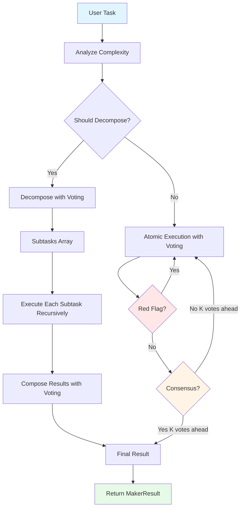
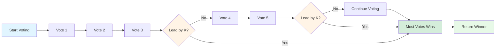

# MAKER Loop Tutorial

> **Achieving Near-Zero Error Rates with Massively Decomposed Agentic Processes**

The MAKER loop implements the groundbreaking framework from the paper ["Solving a Million-Step LLM Task with Zero Errors"](https://arxiv.org/html/2511.09030v1), which achieves unprecedented reliability through extreme task decomposition, multi-agent voting, and uncertainty detection.

## Table of Contents

- [Introduction](#introduction)
- [Key Concepts](#key-concepts)
- [When to Use MAKER](#when-to-use-maker)
- [Prerequisites](#prerequisites)
- [Basic Implementation](#basic-implementation)
- [Configuration](#configuration)
- [Callbacks and Streaming](#callbacks-and-streaming)
- [Frontend Integration](#frontend-integration)
- [Advanced Usage](#advanced-usage)
- [Best Practices](#best-practices)
- [Troubleshooting](#troubleshooting)
- [Comparison with Other Loops](#comparison-with-other-loops)

## Introduction

The MAKER (Massively Decomposed Agentic Processes with first-to-ahead-by-K Error correction and Red-flagging) loop solves a fundamental problem: LLMs make errors, especially on multi-step tasks. Traditional approaches fail after 100-300 steps. MAKER achieves zero errors even on million-step tasks.

### How it Works



### Key Benefits

- ✅ **Near-Zero Error Rates**: Achieves <0.01% error on decomposable tasks
- 🎯 **High Reliability**: Multiple agents vote, decorrelating errors
- 🚩 **Uncertainty Detection**: Automatically retries uncertain responses
- 📊 **Full Transparency**: Detailed execution statistics and step history
- 🔄 **Adaptive**: Automatically decomposes complex tasks

## Key Concepts

### 1. Massively Decomposed Agentic Processes (MDAP)

Instead of having a single LLM solve a complex task, MAKER breaks it into the **smallest possible atomic subtasks**:

```
Task: "Calculate 15! (factorial)"

MDAP Decomposition:
├─ Calculate 15!
│  ├─ Calculate 15 × 14
│  ├─ Calculate result × 13
│  ├─ Calculate result × 12
│  └─ ... (continue to 1)
```

Each subtask is so simple that even a basic model can execute it reliably.

### 2. First-to-Ahead-by-K Voting

For each subtask, multiple micro-agents vote on the answer. The first answer to achieve a lead of K votes wins:



**Example with K=2:**

```
Task: "What is 6 × 7?"

Vote 1: "42"  ← Candidate A
Vote 2: "42"  ← Candidate A (2 votes)
Vote 3: "43"  ← Candidate B (1 vote)

Lead: 2 - 1 = 1 (not >= K=2, continue voting)

Vote 4: "42"  ← Candidate A (3 votes)

Lead: 3 - 1 = 2 (>= K=2, consensus reached!)
Winner: "42"
```

**Voting K Parameter:**
- **K=2**: Fast, moderate reliability (3-5 votes typical)
- **K=3**: Balanced, recommended (5-7 votes typical)
- **K=4**: Very reliable but slow (7-9 votes typical)

### 3. Red-Flagging (Uncertainty Detection)

The system detects linguistic markers of uncertainty and circular reasoning:

```php
// Strong red flags (weight = 1.0):
"wait, maybe..."
"let me reconsider..."
"on second thought..."
"not as we think..."

// Moderate red flags (weight = 0.5):
"actually..."
"I'm not sure..."

// Weak red flags (weight = 0.3):
"wait..."
"hmm..."
"perhaps..."

// Circular reasoning:
// If 70%+ sentences are duplicates → red flag
```

When red flags accumulate to score ≥ 1.0, the response is discarded and a new vote is cast.

## When to Use MAKER

### ✅ Good Use Cases

- **Multi-step mathematical calculations** (factorials, sequences, etc.)
- **Sequential procedures with validation** (data processing pipelines)
- **Complex reasoning with verifiable steps** (logic puzzles, proofs)
- **Tasks requiring high reliability** (financial calculations, medical data)
- **Problems that can be decomposed** (breaking down requirements)

### ❌ Not Suitable For

- **Simple single-step tasks** (use regular `prompt()` instead)
- **Creative/open-ended generation** (stories, marketing copy)
- **Tasks requiring domain knowledge databases** (use RAG with ReAct)
- **Real-time latency-critical applications** (MAKER uses many API calls)
- **Non-decomposable holistic tasks** (art critique, sentiment analysis)

### Comparison: When to Use Each Loop

| Task Type | ReAct | Chain-of-Thought | Plan-Execute | MAKER |
|-----------|-------|------------------|--------------|-------|
| Multi-step with tools | ✅ Best | ⚠️ Okay | ✅ Good | ❌ No |
| Deep reasoning | ⚠️ Okay | ✅ Best | ⚠️ Okay | ⚠️ Okay |
| Sequential planning | ⚠️ Okay | ❌ No | ✅ Best | ⚠️ Okay |
| High-reliability math | ❌ No | ⚠️ Okay | ⚠️ Okay | ✅ Best |
| Multi-step without tools | ⚠️ Okay | ✅ Good | ✅ Good | ✅ Best |

## Prerequisites

```bash
# 1. Install Laragentic
composer require laragentic/agents

# 2. Publish config (optional)
php artisan vendor:publish --tag=agentic-config

# 3. Set API key
ANTHROPIC_API_KEY=your-api-key-here
```

## Basic Implementation

### Step 1: Create Your Agent

```php
<?php

namespace App\Agents;

use Laravel\Ai\Contracts\Agent;
use Laravel\Ai\Promptable;
use Laragentic\Loops\MakerLoop;

class FactorialAgent implements Agent
{
    use Promptable;
    use MakerLoop; // ← Add MAKER loop capability

    public function instructions(): string
    {
        return <<<INSTRUCTIONS
You are a mathematical computation assistant.

When decomposing tasks:
- Break calculations into atomic steps
- Each step should be a single operation
- Number steps clearly

When executing atomic tasks:
- Provide just the numerical result
- Be precise and concise

When composing results:
- Combine step results into final answer
- Show calculation path
INSTRUCTIONS;
    }

    public function model(): string
    {
        return 'claude-opus-4-6';
    }
}
```

### Step 2: Use the MAKER Loop

```php
use App\Agents\FactorialAgent;

// Create agent instance
$agent = new FactorialAgent;

// Execute with MAKER loop
$result = $agent
    ->votingK(3)                    // Set voting threshold
    ->enableRedFlagging(true)       // Enable uncertainty detection
    ->maxDecompositionDepth(5)      // Allow up to 5 levels of decomposition
    ->makerLoop('Calculate 5! (5 factorial) step by step');

// Access results
echo $result->text();               // Final answer
echo $result->totalSteps;           // Number of steps executed
echo $result->errorRate();          // Estimated error rate (0.0-1.0)

// Detailed statistics
$stats = $result->executionStats;
echo "Atomic executions: {$stats['atomic_executions']}";
echo "Decompositions: {$stats['decompositions']}";
echo "Votes cast: {$stats['votes_cast']}";
echo "Red flags detected: {$stats['red_flags_detected']}";
echo "Max depth reached: {$stats['max_depth_reached']}";
```

### Step 3: Handle Results

```php
// Check if loop completed successfully
if ($result->completed()) {
    echo "Success! Answer: {$result->text()}";
} else {
    echo "Max iterations reached";
}

// Get step history for introspection
foreach ($result->steps as $step) {
    echo "Step {$step->iteration} ({$step->type}):";
    echo "  Task: {$step->task}";
    echo "  Votes: {$step->votes}/{$step->totalVotes}";
    echo "  Red flags: {$step->redFlagsDetected}";
}

// Get steps by type
$decompositions = $result->decompositions();
$atomicExecutions = $result->atomicExecutions();
$compositions = $result->compositions();

// Get error analysis
$stepsWithRedFlags = $result->stepsWithRedFlags();
```

## Configuration

### Instance-Level Configuration

Override defaults per agent instance using fluent methods:

```php
$result = $agent
    ->votingK(4)                   // Higher K = more reliable
    ->enableRedFlagging(true)      // Enable uncertainty detection
    ->maxDecompositionDepth(10)    // Allow deeper decomposition
    ->maxMakerIterations(200)      // Increase iteration limit
    ->makerLoop($task);
```

### Global Configuration

Edit `config/agentic.php`:

```php
return [
    'maker' => [
        // Voting K parameter (first-to-ahead-by-K threshold)
        'voting_k' => 3,

        // Enable red-flagging (uncertainty detection)
        'enable_red_flagging' => true,

        // Maximum decomposition depth (recursion limit)
        'max_decomposition_depth' => 10,

        // Maximum total iterations
        'max_iterations' => 100,

        // Throw exception on max iterations?
        'throw_on_max_iterations' => false,

        // Safety cap for votes per decision
        'max_votes' => 15,
    ],
];
```

### Environment Variables

```env
AGENTIC_MAKER_VOTING_K=3
AGENTIC_MAKER_RED_FLAGGING=true
AGENTIC_MAKER_MAX_DEPTH=10
AGENTIC_MAKER_MAX_ITERATIONS=100
AGENTIC_MAKER_THROW_ON_MAX=false
AGENTIC_MAKER_MAX_VOTES=15
```

### Configuration Priority

Instance methods > Environment variables > Config file > Defaults

## Callbacks and Streaming

### Available Callbacks

MAKER provides granular callbacks for every phase:

```php
$agent
    // Loop lifecycle
    ->onLoopStart(function (string $prompt) {
        // Loop begins
    })
    ->onLoopComplete(function (AgentResponse $response, int $totalSteps) {
        // Loop finishes successfully
    })
    ->onMaxIterationsReached(function (AgentResponse $response, int $steps) {
        // Max iterations hit
    })

    // Decomposition
    ->onDecomposition(function (array $subtasks, int $depth, int $iteration) {
        // Task was broken into subtasks
    })

    // Voting
    ->onBeforeVote(function (string $prompt, int $voteNum, int $iteration) {
        // Before each vote
    })
    ->onAfterVote(function (string $response, int $voteNum, int $iteration) {
        // After each vote
    })
    ->onConsensus(function (string $winner, int $votes, int $iteration) {
        // Consensus reached
    })

    // Red flagging
    ->onRedFlag(function (string $response, float $score, int $iteration) {
        // Uncertain response detected
    })

    // Execution
    ->onAtomicExecution(function (string $task, string $result, int $iteration) {
        // Atomic task executed
    })
    ->onComposition(function (string $task, string $result, int $iteration) {
        // Results composed
    });
```

### Streaming to Frontend

Use `makerLoopStream()` with Server-Sent Events (SSE):

```php
Route::post('/calculate', function () {
    return response()->eventStream(function () {
        $agent = new FactorialAgent;

        $agent
            ->votingK(3)
            ->onDecomposition(function ($subtasks, $depth, $iteration) {
                yield new StreamedEvent(
                    event: 'decomposition',
                    data: [
                        'subtasks' => $subtasks,
                        'count' => count($subtasks),
                        'depth' => $depth,
                    ],
                );
            })
            ->onBeforeVote(function ($prompt, $voteNum, $iteration) {
                yield new StreamedEvent(
                    event: 'voting',
                    data: [
                        'vote_number' => $voteNum,
                        'iteration' => $iteration,
                        'stage' => 'before',
                    ],
                );
            })
            ->onConsensus(function ($winner, $votes, $iteration) {
                yield new StreamedEvent(
                    event: 'consensus',
                    data: [
                        'votes' => $votes,
                        'preview' => substr($winner, 0, 100),
                    ],
                );
            })
            ->onRedFlag(function ($response, $score, $iteration) {
                yield new StreamedEvent(
                    event: 'red_flag',
                    data: [
                        'score' => $score,
                        'iteration' => $iteration,
                    ],
                );
            });

        // Stream execution
        $result = yield from $agent->makerLoopStream(
            request('task')
        );

        // Send final result
        yield new StreamedEvent(
            event: 'complete',
            data: [
                'text' => $result->text(),
                'stats' => $result->executionStats,
                'error_rate' => $result->errorRate(),
            ],
        );
    });
});
```

## Frontend Integration

### React/TypeScript Example

```typescript
import { useEffect, useState } from 'react';

interface MakerEvent {
  event: string;
  data: any;
}

function MakerCalculator() {
  const [events, setEvents] = useState<MakerEvent[]>([]);
  const [result, setResult] = useState<string | null>(null);
  const [stats, setStats] = useState<any>(null);

  const calculate = async (task: string) => {
    const response = await fetch('/calculate', {
      method: 'POST',
      headers: { 'Content-Type': 'application/json' },
      body: JSON.stringify({ task }),
    });

    const reader = response.body?.getReader();
    const decoder = new TextDecoder();

    while (true) {
      const { done, value } = await reader!.read();
      if (done) break;

      const chunk = decoder.decode(value);
      const lines = chunk.split('\n');

      for (const line of lines) {
        if (line.startsWith('data: ')) {
          const data = JSON.parse(line.substring(6));
          const event = lines[lines.indexOf(line) - 1]
            .substring(7); // Get event name

          setEvents(prev => [...prev, { event, data }]);

          if (event === 'complete') {
            setResult(data.text);
            setStats(data.stats);
          }
        }
      }
    }
  };

  return (
    <div>
      <h1>MAKER Calculator</h1>

      <button onClick={() => calculate('Calculate 5!')}>
        Calculate 5!
      </button>

      {/* Event Stream */}
      <div className="events">
        {events.map((e, i) => (
          <div key={i} className={`event-${e.event}`}>
            <strong>{e.event}:</strong>
            {e.event === 'decomposition' && (
              <span>{e.data.count} subtasks at depth {e.data.depth}</span>
            )}
            {e.event === 'voting' && (
              <span>Vote {e.data.vote_number}</span>
            )}
            {e.event === 'consensus' && (
              <span>{e.data.votes} votes</span>
            )}
            {e.event === 'red_flag' && (
              <span>⚠️ Score: {e.data.score}</span>
            )}
          </div>
        ))}
      </div>

      {/* Final Result */}
      {result && (
        <div className="result">
          <h2>Result: {result}</h2>
          <div className="stats">
            <div>Steps: {stats.total_steps}</div>
            <div>Votes: {stats.votes_cast}</div>
            <div>Error Rate: {(stats.error_rate * 100).toFixed(2)}%</div>
            <div>Red Flags: {stats.red_flags_detected}</div>
          </div>
        </div>
      )}
    </div>
  );
}
```

## Advanced Usage

### Custom Decomposition Logic

Override `shouldDecompose()` to implement custom logic:

```php
class CustomMakerAgent implements Agent
{
    use Promptable;
    use MakerLoop;

    protected function shouldDecompose(string $task, int $depth): bool
    {
        // Custom decomposition heuristics
        if ($depth >= 3) {
            return false; // Max depth
        }

        // Detect specific patterns
        if (preg_match('/calculate|compute|solve/', $task)) {
            return strlen($task) > 50; // Decompose long calculations
        }

        // Check for keywords indicating complexity
        $complexKeywords = ['then', 'next', 'after', 'and', 'also'];
        foreach ($complexKeywords as $keyword) {
            if (str_contains(strtolower($task), $keyword)) {
                return true;
            }
        }

        return false;
    }
}
```

### Custom Prompts

Override prompt builders for specific domains:

```php
protected function buildDecompositionPrompt(string $task): string
{
    return <<<PROMPT
You are a step-by-step task planner for scientific calculations.

Break down this task into the smallest possible atomic steps:

Task: {$task}

Requirements:
- Each step must be a single mathematical operation
- Number steps clearly (1. 2. 3. etc.)
- Be as granular as possible

Output format:
1. First atomic step
2. Second atomic step
3. Third atomic step
...
PROMPT;
}

protected function buildExecutionPrompt(string $task): string
{
    return <<<PROMPT
Execute this single atomic calculation:

{$task}

Provide ONLY the numerical result. No explanation needed.
Be precise to 6 decimal places if necessary.
PROMPT;
}

protected function buildCompositionPrompt(string $originalTask, array $subtaskResults): string
{
    $resultsText = implode("\n", array_map(
        fn ($i, $r) => "Step " . ($i + 1) . ": {$r}",
        array_keys($subtaskResults),
        $subtaskResults
    ));

    return <<<PROMPT
Original calculation: {$originalTask}

Step results:
{$resultsText}

Combine these results into the final answer.
Show the calculation: [step 1] [operator] [step 2] = [result]
PROMPT;
}
```

### Performance Optimization

```php
// For speed-critical tasks: reduce K and depth
$fastResult = $agent
    ->votingK(2)                    // Faster consensus
    ->maxDecompositionDepth(3)      // Limit recursion
    ->enableRedFlagging(false)      // Skip red flag checks
    ->makerLoop($task);

// For accuracy-critical tasks: increase K and enable all checks
$accurateResult = $agent
    ->votingK(4)                    // Very high reliability
    ->maxDecompositionDepth(10)     // Allow deep decomposition
    ->enableRedFlagging(true)       // Enable uncertainty detection
    ->makerLoop($task);
```

### Handling Tool Integration

While MAKER focuses on decomposition without tools, you can integrate tools in atomic execution:

```php
class MakerWithToolsAgent implements Agent, HasTools
{
    use Promptable;
    use MakerLoop;
    use HasTools;

    public function tools(): iterable
    {
        return [
            new CalculatorTool,
            new DatabaseQueryTool,
        ];
    }

    // Tool calls happen during atomic execution automatically
    // The loop will call tools if the LLM requests them
}
```

## Best Practices

### 1. Choose the Right K

```php
// Simple arithmetic → K=2
$agent->votingK(2)->makerLoop('What is 7 × 8?');

// Complex multi-step → K=3 (recommended)
$agent->votingK(3)->makerLoop('Calculate (5! + 3!) × 2');

// Critical financial calculations → K=4
$agent->votingK(4)->makerLoop('Calculate compound interest for $10,000 at 5% over 10 years');
```

### 2. Always Enable Red-Flagging

Unless you have a specific reason not to:

```php
$agent->enableRedFlagging(true); // ← Recommended for all uses
```

### 3. Set Appropriate Depth

```php
// Short tasks (< 5 steps)
->maxDecompositionDepth(3)

// Medium tasks (5-20 steps)
->maxDecompositionDepth(5) // Default

// Complex tasks (20+ steps)
->maxDecompositionDepth(10)
```

### 4. Monitor Performance

```php
$result = $agent->makerLoop($task);

// Check if execution was efficient
if ($result->executionStats['votes_cast'] > $result->executionStats['atomic_executions'] * 10) {
    logger()->warning('High vote count - task may be ambiguous', [
        'task' => $task,
        'votes' => $result->executionStats['votes_cast'],
        'executions' => $result->executionStats['atomic_executions'],
    ]);
}

// Check for many red flags
if ($result->executionStats['red_flags_detected'] > $result->totalSteps * 0.1) {
    logger()->warning('Many red flags detected - model may be confused', [
        'task' => $task,
        'red_flags' => $result->executionStats['red_flags_detected'],
    ]);
}
```

### 5. Cost Estimation

MAKER uses multiple API calls per subtask:

```
Total API calls ≈ subtasks × (2K-1) × (1 + red_flag_retries)
```

Example for 10 subtasks with K=3:
- Minimum votes per subtask: 5 (2×3-1)
- Maximum (if no consensus): 15
- Total calls: 50-150
- Decomposition calls: ~5-10
- Composition calls: ~5-10
- **Estimated total: 60-170 API calls**

Cost optimization:
```php
// Use cheaper models for simple decomposition
$agent->model('claude-haiku-4'); // vs claude-opus-4-6

// Reduce K for less critical tasks
$agent->votingK(2); // vs 3 or 4

// Limit depth to reduce decomposition
$agent->maxDecompositionDepth(3); // vs 10
```

## Troubleshooting

### Problem: Max Iterations Reached

```php
// Symptom
$result->reachedMaxIterations === true

// Solutions:
// 1. Increase iteration limit
$agent->maxMakerIterations(200); // Default: 100

// 2. Reduce decomposition depth (fewer subtasks)
$agent->maxDecompositionDepth(3); // Default: 10

// 3. Simplify the task
// "Calculate 20!" → "Calculate 5!"
```

### Problem: High Vote Counts

```php
// Symptom
$result->executionStats['votes_cast'] >> expected

// Solutions:
// 1. Lower K (accept earlier consensus)
$agent->votingK(2); // vs 3 or 4

// 2. Make prompts more specific
protected function buildExecutionPrompt(string $task): string
{
    return "Execute: {$task}\nProvide ONLY the number, nothing else.";
}

// 3. Use better decomposition
protected function buildDecompositionPrompt(string $task): string
{
    return "Break {$task} into VERY SPECIFIC atomic steps.";
}
```

### Problem: Many Red Flags

```php
// Symptom
$result->executionStats['red_flags_detected'] > 10

// Solutions:
// 1. Improve instructions clarity
public function instructions(): string
{
    return "Be CONFIDENT. Provide direct answers. No hedging.";
}

// 2. Use a more capable model
$agent->model('claude-opus-4-6'); // vs haiku or sonnet

// 3. Temporarily disable if model is naturally uncertain
$agent->enableRedFlagging(false); // Last resort
```

### Problem: Incorrect Decomposition

```php
// Symptom
Subtasks don't make sense or are too coarse

// Solutions:
// 1. Override decomposition prompt
protected function buildDecompositionPrompt(string $task): string
{
    return <<<PROMPT
Break {$task} into ATOMIC steps.

Each step should be ONE operation:
- One calculation
- One lookup
- One comparison

BAD: "Calculate factorial and sum"
GOOD: "1. Calculate 5×4\n2. Calculate result×3\n3. Calculate result×2\n4. Calculate result×1"
PROMPT;
}

// 2. Provide examples in instructions
public function instructions(): string
{
    return <<<INSTRUCTIONS
When decomposing:

Example 1:
Task: "5! + 3!"
Decomposition:
1. Calculate 5!
2. Calculate 3!
3. Add results

Example 2:
Task: "Calculate 5!"
Decomposition:
1. Calculate 5×4
2. Calculate 20×3
3. Calculate 60×2
4. Calculate 120×1
INSTRUCTIONS;
}
```

### Problem: Slow Execution

```php
// Symptom
Takes too long to complete

// Solutions:
// 1. Reduce K
$agent->votingK(2); // Fewer votes needed

// 2. Limit decomposition
$agent->maxDecompositionDepth(3);

// 3. Use faster model
$agent->model('claude-haiku-4');

// 4. Disable red-flagging for speed
$agent->enableRedFlagging(false);

// Performance mode preset:
$agent
    ->votingK(2)
    ->maxDecompositionDepth(3)
    ->enableRedFlagging(false)
    ->makerLoop($task);
```

## Comparison with Other Loops

### ReAct vs MAKER

| Feature | ReAct | MAKER |
|---------|-------|-------|
| Best for | Tool-based tasks | Multi-step calculations |
| Error correction | None | Multi-agent voting |
| Tools | ✅ Yes | ⚠️ Limited |
| Reliability | Moderate | Very high |
| Speed | Fast | Slow |
| Token usage | Low | High |

**Use ReAct when:** You need tools, real-time interaction, or single-pass execution

**Use MAKER when:** You need high reliability on decomposable tasks without tools

### Chain-of-Thought vs MAKER

| Feature | Chain-of-Thought | MAKER |
|---------|------------------|-------|
| Best for | Deep reasoning | Verifiable calculations |
| Self-reflection | ✅ Yes | ❌ No |
| Error correction | Self-evaluation | Multi-agent voting |
| Reliability | Good | Excellent |
| Complexity | Handles abstraction | Needs decomposability |

**Use CoT when:** Task requires understanding, reasoning through ambiguity

**Use MAKER when:** Task has clear steps and verification is possible

### Plan-Execute vs MAKER

| Feature | Plan-Execute | MAKER |
|---------|--------------|-------|
| Best for | Sequential workflows | Atomic calculations |
| Planning | ✅ Explicit | ❌ Implicit (decomposition) |
| Replanning | ✅ Yes | ❌ No |
| Error correction | Replan on failure | Multi-agent voting |
| Step validation | Optional | Built-in (voting) |

**Use Plan-Execute when:** Need adaptive planning, can replan on failure

**Use MAKER when:** Task is fully decomposable, need maximum reliability

## Summary

MAKER achieves near-zero error rates through:

1. **Extreme decomposition** - Breaking tasks into atomic subtasks
2. **Multi-agent voting** - Multiple agents vote, first-to-ahead-by-K wins
3. **Red-flagging** - Detecting and retrying uncertain responses

Perfect for:
- ✅ Multi-step calculations requiring high accuracy
- ✅ Sequential procedures with clear verification
- ✅ Tasks that can be decomposed into atomic steps

Not suitable for:
- ❌ Creative or open-ended generation
- ❌ Tasks requiring external tools or databases
- ❌ Real-time latency-critical applications

**Configuration at a glance:**

```php
$result = $agent
    ->votingK(3)                    // Voting threshold: 2-4
    ->enableRedFlagging(true)       // Uncertainty detection
    ->maxDecompositionDepth(5)      // Recursion limit
    ->maxMakerIterations(100)       // Total step limit
    ->makerLoop('Your task here');
```

**Next steps:**
- Try the tutorial examples in `routes/tutorial.php`
- Read the paper: [arxiv.org/html/2511.09030v1](https://arxiv.org/html/2511.09030v1)
- Experiment with different K values for your use case
- Monitor execution statistics to optimize performance

---

**Questions or issues?** Open an issue on [GitHub](https://github.com/laragentic/laragentic)
