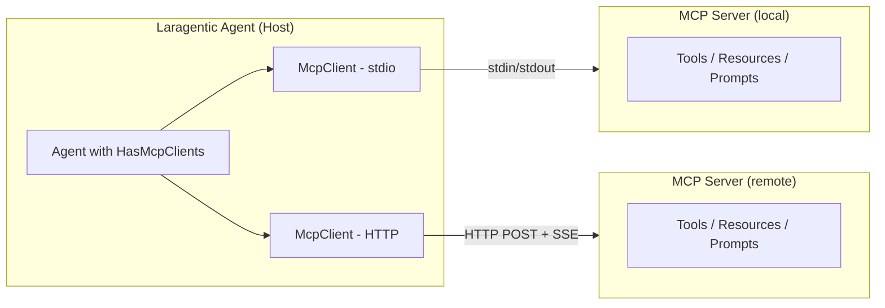
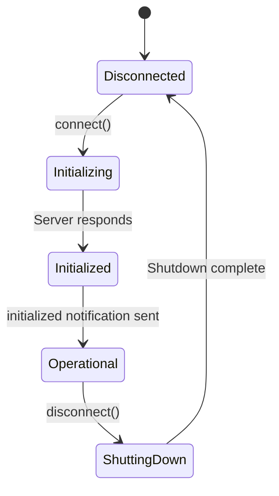

# MCP Client Tutorial

## Table of Contents

1. [Introduction](#introduction)
2. [Architecture](#architecture)
3. [Quick Start](#quick-start)
4. [HTTP Servers](#http-servers)
5. [Using MCP Tools](#using-mcp-tools)
6. [Using MCP Resources](#using-mcp-resources)
7. [Using MCP Prompts](#using-mcp-prompts)
8. [Providing Roots](#providing-roots)
9. [Sampling](#sampling)
10. [Elicitation](#elicitation)
11. [Multiple Servers](#multiple-servers)
12. [Combining with Skills](#combining-with-skills)
13. [Configuration](#configuration)
14. [Streaming & Progress](#streaming--progress)
15. [Security](#security)
16. [Troubleshooting](#troubleshooting)

---

## Introduction

The **Model Context Protocol (MCP)** is an open standard that lets AI agents connect to external tools, data sources, and services through a unified interface. Instead of writing custom integrations for every API, you connect to MCP servers that expose capabilities your agent can discover and use at runtime.

Laragentic's MCP client implements the full MCP specification (protocol version `2025-11-25`), giving your agents access to the growing ecosystem of MCP servers — filesystem access, databases, web browsers, code interpreters, and more.

### Key Benefits

- **Dynamic Tool Discovery** — agents discover available tools at runtime, no hardcoding needed
- **Standardized Protocol** — connect to any MCP-compatible server with zero custom code
- **Multiple Transports** — stdio for local processes, Streamable HTTP for remote servers
- **Full Feature Coverage** — tools, resources, prompts, roots, sampling, and elicitation
- **Seamless Integration** — MCP tools appear as native Laragentic tools in your agent loops

---

## Architecture

The MCP architecture follows a Host → Client → Server model. Your Laragentic agent is the **host**, the `McpClient` manages the **client** session, and an external process or HTTP endpoint is the **server**.



**Key components:**

| Component | Role |
|---|---|
| `HasMcpClients` | Trait that adds MCP support to any agent |
| `McpServer` | Configuration object defining how to reach a server |
| `McpClient` | Manages a stateful 1:1 session with one server |
| `McpSession` | Tracks connection lifecycle phases |
| `StdioTransport` | Communicates via stdin/stdout with a child process |
| `StreamableHttpTransport` | Communicates via HTTP POST with SSE responses |

### Connection Lifecycle



During initialization, the client and server exchange capabilities so each side knows what the other supports.

---

## Quick Start

The fastest way to use MCP is to add the `HasMcpClients` trait to your agent and define which servers to connect to.

### 1. Define Your Agent

```php
use Laragentic\Agents\Agent;
use Laragentic\Agents\Contracts\Conversational;
use Laragentic\Agents\Contracts\HasTools;
use Laragentic\Agents\Concerns\Promptable;
use Laragentic\Agents\Concerns\RemembersConversations;
use Laragentic\Agents\Loops\ReActLoop;
use Laragentic\Mcp\HasMcpClients;
use Laragentic\Mcp\McpServer;

class FilesystemAgent implements Agent, Conversational, HasTools
{
    use Promptable, RemembersConversations, ReActLoop, HasMcpClients;

    public function mcpServers(): array
    {
        return [
            McpServer::stdio(
                name: 'filesystem',
                command: 'npx',
                args: ['-y', '@modelcontextprotocol/server-filesystem', '/tmp'],
            ),
        ];
    }

    public function instructions(): string
    {
        return 'You are a helpful assistant that can read and write files.';
    }
}
```

### 2. Connect and Use

```php
$agent = new FilesystemAgent();

// Connect to all configured MCP servers
$agent->connectMcpServers();

// MCP tools are automatically available in agent loops.
// You can also retrieve them explicitly:
$tools = $agent->mcpTools(); // Returns Tool[] adapters

// When done, disconnect gracefully
$agent->disconnectMcpServers();
```

That's it. The agent discovers the filesystem server's tools (`read_file`, `write_file`, `list_directory`, etc.) and can use them in its reasoning loop just like native Laragentic tools.

---

## HTTP Servers

For remote MCP servers, use the Streamable HTTP transport. This is ideal for shared services, cloud-hosted tools, or servers behind authentication.

```php
public function mcpServers(): array
{
    return [
        McpServer::http(
            name: 'database',
            url: 'https://db-server.example.com/mcp',
            headers: [
                'Authorization' => 'Bearer ' . config('services.mcp_db.token'),
            ],
        ),
    ];
}
```

### How It Works

- Every message is sent as an **HTTP POST** to the server URL
- Responses come back as `application/json` or `text/event-stream` (SSE)
- The transport automatically manages the `Mcp-Session-Id` header for session continuity
- Configurable timeout (default 30 seconds) and SSE reconnection delay

### Stdio vs HTTP

| Feature | Stdio | HTTP |
|---|---|---|
| Server location | Local process | Remote endpoint |
| Startup | Client spawns the process | Server already running |
| Auth | Not needed (local) | Headers (Bearer, API keys) |
| Session ID | N/A | Managed via HTTP header |
| Best for | Dev tools, local utilities | Shared services, cloud APIs |

---

## Using MCP Tools

MCP tools are the most common feature. They let servers expose callable functions your agent can invoke.

### Automatic Discovery

When you call `$agent->mcpTools()`, the client fetches the tool list from each connected server and wraps them as native Laragentic `Tool` adapters. These work seamlessly in any agent loop (ReAct, ChainOfThought, PlanExecute).

```php
$agent->connectMcpServers();

// Tools are auto-discovered and ready to use
$tools = $agent->mcpTools();
// Returns McpToolAdapter[] — each implements the Tool contract
```

### Manual Tool Calling

You can also call tools directly through the `McpClient`:

```php
$client = $agent->mcpClient('filesystem');

// List available tools
$toolDefinitions = $client->tools()->list(); // Collection<ToolDefinition>

foreach ($toolDefinitions as $tool) {
    echo $tool->name;          // e.g., "read_file"
    echo $tool->description;   // e.g., "Read the contents of a file"
    echo $tool->inputSchema;   // JSON Schema for arguments
}

// Call a tool
$result = $client->tools()->call('read_file', [
    'path' => '/tmp/example.txt',
]);

echo $result->text();     // File contents
echo $result->isError;    // false
```

### Tool Annotations

MCP tools can include annotations that describe their behavior:

```php
$tool = $toolDefinitions->first();

$tool->isReadOnly();            // Safe to call without side effects?
$tool->isDestructive();         // Could this delete or modify data?
$tool->requiresConfirmation();  // Should the user confirm first?
```

### Reacting to Tool List Changes

Servers can notify the client when their tool list changes:

```php
$client->tools()->onListChanged(function () {
    // Tool list has been updated, cache is automatically cleared
    $freshTools = $client->tools()->list();
});
```

---

## Using MCP Resources

Resources let servers expose data (files, database records, API responses) that your agent can read for context.

### Listing Resources

```php
$client = $agent->mcpClient('filesystem');

// List all resources (auto-paginates)
$resources = $client->resources()->listAll(); // Collection<ResourceDefinition>

foreach ($resources as $resource) {
    echo $resource->uri;          // e.g., "file:///home/user/notes.txt"
    echo $resource->name;         // e.g., "notes.txt"
    echo $resource->mimeType;     // e.g., "text/plain"
    echo $resource->description;  // Optional description
}
```

### Reading Resources

```php
$content = $client->resources()->read('file:///home/user/notes.txt');

if ($content->isText()) {
    echo $content->text();
}

if ($content->isBinary()) {
    $bytes = $content->content(); // Decoded from base64
}
```

### Resource Templates

Servers can expose URI templates (RFC 6570) for parameterized resources:

```php
$templates = $client->resources()->listTemplates();

foreach ($templates as $template) {
    echo $template->uriTemplate; // e.g., "db://users/{id}"
    echo $template->name;
}
```

### Subscribing to Changes

```php
$client->resources()->subscribe('file:///home/user/config.json');

$client->resources()->onResourceUpdated(function (string $uri) {
    $freshContent = $client->resources()->read($uri);
    // Handle updated content...
});
```

### Aggregated Resources

When using multiple servers, retrieve all resources with server-prefixed keys:

```php
$allResources = $agent->mcpResources(); // Collection keyed by "server:uri"
```

---

## Using MCP Prompts

Prompts let servers provide reusable prompt templates with typed arguments.

### Listing Prompts

```php
$client = $agent->mcpClient('database');

$prompts = $client->prompts()->listAll(); // Collection<PromptDefinition>

foreach ($prompts as $prompt) {
    echo $prompt->name;            // e.g., "explain-query"
    echo $prompt->description;     // e.g., "Explain a SQL query"
    echo $prompt->arguments;       // Argument definitions
    echo $prompt->requiredArguments(); // Only required ones
}
```

### Getting a Prompt

```php
$messages = $client->prompts()->get('explain-query', [
    'query' => 'SELECT * FROM users WHERE active = 1',
]);

foreach ($messages as $message) {
    echo $message->role;   // "user" or "assistant"
    echo $message->text(); // Message content

    $message->isUser();      // true if role is "user"
    $message->isAssistant(); // true if role is "assistant"
}
```

### Aggregated Prompts

```php
$allPrompts = $agent->mcpPrompts(); // Collection keyed by "server:name"
```

---

## Providing Roots

Roots tell the server which filesystem locations the client considers relevant. This helps servers scope their operations to appropriate directories.

### Defining Roots

Override `mcpRoots()` in your agent:

```php
public function mcpRoots(): array
{
    return [
        Root::fromPath('/home/user/projects', 'projects'),
        Root::fromPath('/home/user/documents', 'documents'),
    ];
}
```

The `Root::fromPath()` helper automatically converts filesystem paths to `file://` URIs.

### Dynamic Root Management

You can also manage roots at runtime through the client:

```php
$client = $agent->mcpClient('filesystem');

// Add a root
$client->roots()->addRoot(
    Root::fromPath('/tmp/workspace', 'workspace'),
);

// Replace all roots
$client->roots()->setRoots([
    Root::fromPath('/new/path', 'new-root'),
]);

// Notify the server that roots changed
$client->roots()->notifyChange();

// Query current roots
$roots = $client->roots()->getRoots();
```

When the server sends a `roots/list` request, the client automatically responds with the configured roots.

---

## Sampling

Sampling allows the server to request LLM completions from the client. This is useful when the server needs AI reasoning as part of its own processing — for example, an MCP server that uses AI to classify data before returning results.

### Setting Up a Sampling Delegate

```php
use Laragentic\Mcp\Features\Sampling\SamplingRequest;
use Laragentic\Mcp\Features\Sampling\SamplingResult;

$client = $agent->mcpClient('analysis-server');

$client->sampling()->setDelegate(function (SamplingRequest $request) {
    // The server is asking us to generate a completion.
    // Route to your LLM of choice:
    $response = YourLlm::complete(
        messages: $request->messages,
        maxTokens: $request->maxTokens,
        systemPrompt: $request->systemPrompt,
    );

    return SamplingResult::text($response->text, 'claude-sonnet-4-5-20250929');
});
```

### Sampling Request Details

The `SamplingRequest` includes everything the server wants:

```php
$client->sampling()->setDelegate(function (SamplingRequest $request) {
    $request->messages;          // Conversation messages
    $request->maxTokens;         // Token limit
    $request->systemPrompt;      // Optional system prompt
    $request->modelPreferences;  // ModelPreferences object
    $request->stopSequence;      // Optional stop sequence
    $request->hasTools();        // Whether tools are requested
    $request->tools;             // Tool definitions (if any)
    $request->toolChoice;        // Tool choice config

    // Model preferences include hints and priorities
    $prefs = $request->modelPreferences;
    $prefs->modelHints();          // Suggested model names
    $prefs->costPriority;          // 0.0-1.0
    $prefs->speedPriority;         // 0.0-1.0
    $prefs->intelligencePriority;  // 0.0-1.0

    return SamplingResult::text('response', 'your-model-name');
});
```

### Monitoring Sampling Requests

```php
$client->sampling()->onRequest(function (SamplingRequest $request) {
    Log::info('Sampling requested', [
        'message_count' => count($request->messages),
        'has_tools' => $request->hasTools(),
    ]);
});
```

### Auto-Approve

By default, sampling requests require explicit handling. For trusted servers:

```php
$client->sampling()->setAutoApprove(true);
```

---

## Elicitation

Elicitation allows the server to request user input — either structured form data or URL consent. This is useful when a server needs the user to fill in credentials, approve an OAuth flow, or provide configuration values.

### Handling Form Elicitation

```php
$client = $agent->mcpClient('auth-server');

$client->elicitation()->onForm(function (array $requestedSchema, string $message) {
    // $message: "Please provide your database credentials"
    // $requestedSchema: JSON Schema describing the expected fields

    // Collect user input (via your UI, CLI prompt, etc.)
    $userInput = collectFromUser($requestedSchema);

    return [
        'action' => 'accept',
        'content' => $userInput, // Matches the requested schema
    ];

    // Or decline:
    // return ['action' => 'decline'];
});
```

### Handling URL Elicitation

```php
$client->elicitation()->onUrl(function (string $url, string $message) {
    // $message: "Please authorize access to your GitHub account"
    // $url: "https://github.com/login/oauth/authorize?..."

    // Show the URL to the user, wait for them to complete the flow
    openBrowser($url);
    waitForCallback();

    return ['action' => 'accept'];

    // Or decline:
    // return ['action' => 'decline'];
});
```

### Default Behavior

If no handler is registered for a particular elicitation mode, the client automatically responds with `['action' => 'decline']`. This is safe — the server knows the client couldn't fulfill the request and can fall back gracefully.

### Detecting Elicitation Errors

Some servers may return error code `-32042` when URL elicitation is required but wasn't handled:

```php
try {
    $result = $client->tools()->call('oauth-tool', ['scope' => 'read']);
} catch (McpProtocolException $e) {
    if ($e->isUrlElicitationRequired()) {
        // The server needs URL consent — set up an elicitation handler and retry
    }
}
```

---

## Multiple Servers

A single agent can connect to multiple MCP servers simultaneously. Each server's tools, resources, and prompts are aggregated automatically.

### Configuration

```php
public function mcpServers(): array
{
    return [
        McpServer::stdio('filesystem', 'npx', ['-y', '@modelcontextprotocol/server-filesystem', '/tmp']),
        McpServer::stdio('git', 'npx', ['-y', '@modelcontextprotocol/server-git']),
        McpServer::http('database', 'https://db.example.com/mcp', [
            'Authorization' => 'Bearer ' . config('services.db.token'),
        ]),
    ];
}
```

### Aggregated Discovery

```php
$agent->connectMcpServers();

// All tools from all servers, merged into one array
$allTools = $agent->mcpTools();

// All resources, keyed by "server:uri"
$allResources = $agent->mcpResources();

// All prompts, keyed by "server:name"
$allPrompts = $agent->mcpPrompts();
```

### Accessing Individual Clients

```php
$fsClient = $agent->mcpClient('filesystem');   // McpClient or null
$dbClient = $agent->mcpClient('database');

// Get the full map
$clients = $agent->mcpClientMap(); // ['filesystem' => McpClient, ...]
```

### Per-Server Callbacks

Lifecycle callbacks fire for each server individually:

```php
$agent
    ->onMcpServerConnected(function (McpClient $client) {
        Log::info("Connected to {$client->serverName()}");
    })
    ->onMcpServerConnectionFailed(function (McpClient $client) {
        Log::warning("Failed to connect to {$client->serverName()}");
    })
    ->onMcpServerDisconnected(function (McpClient $client) {
        Log::info("Disconnected from {$client->serverName()}");
    });
```

---

## Combining with Skills

MCP tools work alongside Laragentic's native Agent Skills system. MCP provides runtime-discovered external tools, while Skills provide instruction-based capabilities. Use them together for maximum flexibility.

```php
class FullFeaturedAgent implements Agent, Conversational, HasTools
{
    use Promptable, RemembersConversations, ReActLoop, HasMcpClients;

    public function mcpServers(): array
    {
        return [
            McpServer::stdio('filesystem', 'npx', ['-y', '@modelcontextprotocol/server-filesystem', '/tmp']),
        ];
    }

    public function tools(): array
    {
        return [
            // Native Laragentic tools
            new SearchDatabase(),
            new SendEmail(),

            // MCP tools are merged automatically by the trait.
            // You can also merge them explicitly:
            ...$this->mcpTools(),
        ];
    }

    public function instructions(): string
    {
        return 'You can search databases, send emails, and manage files.';
    }
}
```

The agent's reasoning loop sees all tools — native and MCP — in a single unified list. It picks the right tool for each step without knowing or caring where the tool came from.

---

## Configuration

All MCP settings live in `config/agentic.php` under the `mcp` key.

### Full Reference

```php
'mcp' => [
    // Master switch to enable/disable MCP support
    'enabled' => env('AGENTIC_MCP_ENABLED', true),

    // Client capabilities advertised during initialization
    'capabilities' => [
        'roots' => true,              // Provide filesystem root boundaries
        'sampling' => true,           // Handle server-initiated LLM requests
        'sampling_tools' => true,     // Allow tools in sampling requests
        'elicitation_form' => true,   // Handle form-based user input requests
        'elicitation_url' => true,    // Handle URL consent requests
    ],

    // Client identification sent to servers
    'client_info' => [
        'name' => env('AGENTIC_MCP_CLIENT_NAME', 'laragentic'),
        'version' => env('AGENTIC_MCP_CLIENT_VERSION', '1.0.0'),
    ],

    // Transport-level settings
    'transports' => [
        'stdio' => [
            'shutdown_timeout' => 5,  // Seconds to wait for graceful exit
            'sigterm_timeout' => 3,   // Seconds after SIGTERM before SIGKILL
        ],
        'http' => [
            'timeout' => 30,              // HTTP request timeout in seconds
            'sse_reconnect_delay' => 1000, // SSE reconnection delay in ms
        ],
    ],

    // Protocol-level settings
    'protocol' => [
        'version' => '2025-11-25',   // MCP protocol version
        'request_timeout' => 30,      // Seconds to wait for a response
    ],

    // Sampling (server-initiated LLM) settings
    'sampling' => [
        'auto_approve' => false,      // Auto-approve sampling requests
        'max_iterations' => 10,       // Max sampling rounds per session
        'rate_limit' => 60,           // Max requests per minute
    ],

    // Log forwarding settings
    'logging' => [
        'channel' => env('AGENTIC_MCP_LOG_CHANNEL', 'stack'),
        'default_level' => 'info',    // Minimum log level to forward
    ],
],
```

### Environment Variables

| Variable | Default | Description |
|---|---|---|
| `AGENTIC_MCP_ENABLED` | `true` | Enable/disable MCP support |
| `AGENTIC_MCP_CLIENT_NAME` | `laragentic` | Client name sent to servers |
| `AGENTIC_MCP_CLIENT_VERSION` | `1.0.0` | Client version sent to servers |
| `AGENTIC_MCP_LOG_CHANNEL` | `stack` | Laravel log channel for MCP logs |

---

## Streaming & Progress

### Progress Tracking

MCP supports progress tokens that let you track long-running operations:

```php
$client = $agent->mcpClient('processing-server');

// Create a unique progress token
$token = $client->progress()->createToken(); // e.g., "progress_1"

// Listen for progress updates
$client->progress()->onProgress(function (
    string $token,
    float $progress,
    ?float $total,
    ?string $message,
) {
    if ($total) {
        $pct = round(($progress / $total) * 100);
        echo "{$pct}% — {$message}";
    } else {
        echo "Step {$progress} — {$message}";
    }
});

// Pass the token when making requests (server uses it to report progress)
$result = $client->request('tools/call', [
    'name' => 'process-dataset',
    'arguments' => ['file' => '/data/large.csv'],
    '_meta' => ['progressToken' => $token],
]);
```

### Log Streaming

Servers can stream log messages to the client:

```php
// Set the minimum log level to receive
$client->logging()->setLevel('debug'); // debug, info, notice, warning, error, ...

// Listen for log messages
$client->logging()->onMessage(function (string $level, ?string $logger, mixed $data) {
    echo "[{$level}] {$logger}: " . json_encode($data);
});
```

Log messages are also automatically forwarded to the Laravel log channel configured in `agentic.mcp.logging.channel`.

### Non-Blocking Message Processing

For real-time updates in long-running operations:

```php
$client->onNotification(function (JsonRpcMessage $message) {
    // Handle any notification from the server
    echo "Received: {$message->method}";
});

// Process pending messages without blocking
$client->processMessages();
```

---

## Security

### Trust Levels

Mark servers as trusted or untrusted to control how your application handles them:

```php
McpServer::stdio('internal-tool', 'my-tool', trusted: true);
McpServer::http('third-party', 'https://api.example.com/mcp', trusted: false);
```

Untrusted is the default. Use the `trusted` flag to gate behavior in your application (e.g., auto-approving sampling only for trusted servers).

### Tool Annotations

Check tool annotations before executing potentially dangerous operations:

```php
$tool = $client->tools()->list()->first();

if ($tool->isDestructive() || $tool->requiresConfirmation()) {
    // Prompt the user for confirmation before calling
}
```

### Sampling Safety

Sampling lets the server trigger LLM calls through your client. Guard against abuse:

```php
// Keep auto-approve off for untrusted servers (this is the default)
$client->sampling()->setAutoApprove(false);

// Use the delegate to validate requests before fulfilling them
$client->sampling()->setDelegate(function (SamplingRequest $request) {
    // Validate the request
    if (count($request->messages) > 50) {
        throw new \RuntimeException('Too many messages in sampling request');
    }

    // Enforce token limits
    $maxTokens = min($request->maxTokens ?? 1000, 4096);

    return SamplingResult::text(
        YourLlm::complete($request->messages, maxTokens: $maxTokens),
        'your-model',
    );
});
```

### Capability Configuration

Disable capabilities you don't need to reduce your attack surface:

```php
// config/agentic.php
'capabilities' => [
    'roots' => false,            // Don't expose filesystem paths
    'sampling' => false,         // Don't allow server-initiated LLM calls
    'elicitation_form' => false, // Don't allow form elicitation
    'elicitation_url' => false,  // Don't allow URL elicitation
],
```

### HTTP Authentication

Always use authentication for remote HTTP servers:

```php
McpServer::http('production-db', 'https://db.example.com/mcp', [
    'Authorization' => 'Bearer ' . config('services.mcp_db.token'),
]);
```

Store tokens in environment variables, never in code.

---

## Troubleshooting

### Connection Failures

**Problem:** `McpConnectionException` when calling `connectMcpServers()`

**Causes & Solutions:**

- **Stdio**: The command doesn't exist or isn't in PATH. Verify with `which npx` or `which your-command`.
- **HTTP**: The URL is unreachable or returns non-200. Test with `curl`.
- **Permissions**: The stdio process doesn't have permission to access its working directory.

```php
try {
    $agent->connectMcpServers();
} catch (McpConnectionException $e) {
    Log::error('MCP connection failed: ' . $e->getMessage());
}
```

### Timeout Errors

**Problem:** `McpTimeoutException` on tool calls

**Solution:** Increase the request timeout:

```php
// config/agentic.php
'protocol' => [
    'request_timeout' => 60, // Increase from default 30s
],

// Or per-request:
$result = $client->request('tools/call', $params, timeout: 60.0);
```

### Capability Errors

**Problem:** `McpCapabilityException` — "Server does not support X"

**Solution:** The server doesn't advertise the capability you're trying to use. Check what the server supports:

```php
$caps = $client->serverCapabilities();

$caps->supportsTools();          // Can you call tools?
$caps->supportsResources();      // Can you read resources?
$caps->supportsPrompts();        // Can you get prompts?
$caps->supportsLogging();        // Can you set log levels?
$caps->supportsCompletions();    // Can you use auto-complete?
```

### Protocol Errors

**Problem:** `McpProtocolException` with a JSON-RPC error code

**Common codes:**

| Code | Meaning |
|---|---|
| `-32700` | Parse error — invalid JSON |
| `-32600` | Invalid request |
| `-32601` | Method not found |
| `-32602` | Invalid params |
| `-32603` | Internal error |
| `-32042` | URL elicitation required |

```php
try {
    $result = $client->tools()->call('some-tool', $args);
} catch (McpProtocolException $e) {
    echo $e->errorCode();  // e.g., -32601
    echo $e->errorData();  // Additional error details
}
```

### Stdio Process Cleanup

If a stdio server process hangs during shutdown, the transport follows a graceful sequence:

1. Close stdin (signals the process to exit)
2. Wait up to `shutdown_timeout` seconds (default 5)
3. Send SIGTERM
4. Wait up to `sigterm_timeout` seconds (default 3)
5. Send SIGKILL as a last resort

Adjust these in config if your server needs more time to shut down:

```php
'transports' => [
    'stdio' => [
        'shutdown_timeout' => 10,
        'sigterm_timeout' => 5,
    ],
],
```

### Cancellation

Cancel a long-running request:

```php
$requestId = 42; // The ID of the pending request

$client->cancellation()->cancel($requestId, 'User cancelled the operation');

// Listen for server-initiated cancellations
$client->cancellation()->onCancelled(function (string|int $requestId, ?string $reason) {
    Log::info("Request {$requestId} cancelled: {$reason}");
});
```

### Auto-Complete

Use the completion client to get argument suggestions:

```php
$suggestions = $client->completions()->completePromptArgument(
    promptName: 'explain-query',
    argumentName: 'dialect',
    argumentValue: 'post', // Partial input
);
// Returns: ['values' => ['postgresql', 'postgreql-14'], 'hasMore' => false]

$suggestions = $client->completions()->completeResourceArgument(
    resourceUri: 'db://tables/{name}',
    argumentName: 'name',
    argumentValue: 'us', // Partial input
);
// Returns: ['values' => ['users', 'user_sessions'], 'hasMore' => true, 'total' => 15]
```

### Debugging

Enable verbose logging to see all MCP traffic:

```php
// Set the log level to debug
$client->logging()->setLevel('debug');

// Log all notifications
$client->onNotification(function (JsonRpcMessage $msg) {
    Log::debug('MCP notification', [
        'method' => $msg->method,
        'params' => $msg->params,
    ]);
});

// Read stderr from stdio servers for server-side errors
$stderr = $client->serverConfig()->isStdio()
    ? 'Check server stderr output'
    : 'Check server HTTP logs';
```
