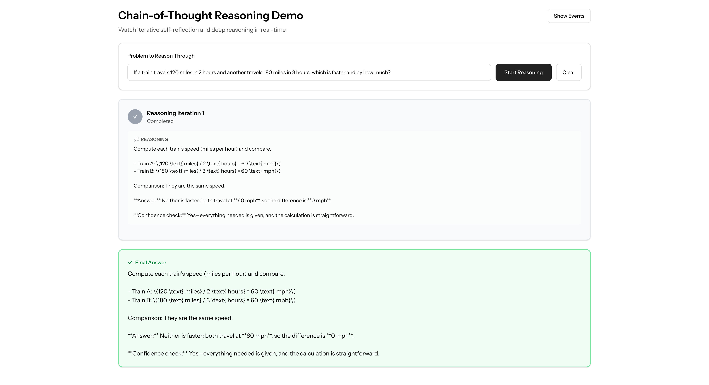
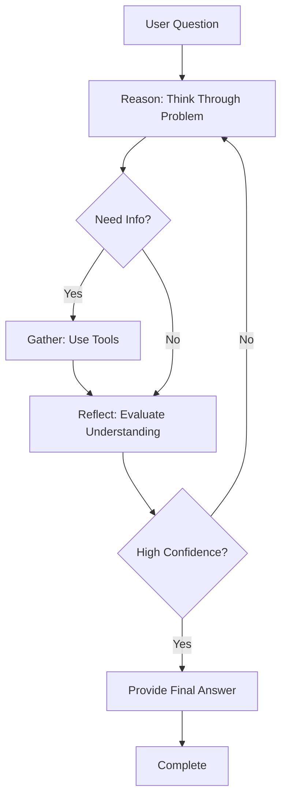

# Streaming Chain-of-Thought Loop

Deep dive into the Chain-of-Thought (CoT) reasoning pattern with iterative self-reflection and real-time streaming.



_Watch the agent think deeply, question its understanding, gather information, and reflect on its confidence — transparent reasoning in real-time._

## What is Chain-of-Thought?

Chain-of-Thought is an advanced agentic AI pattern that enables **deep, iterative reasoning with self-reflection**. Unlike ReAct (which focuses on tool usage) or Plan-Execute (which focuses on structured steps), CoT emphasizes transparent thinking and confidence evaluation:



### The CoT Reasoning Cycle

1. **REASON**: Think step-by-step through the problem
2. **GATHER**: Use tools when information is needed
3. **REFLECT**: Evaluate understanding and confidence
4. **ITERATE**: Continue reasoning until confident in the answer

This pattern produces agents that:
- Show their thinking process transparently
- Identify knowledge gaps explicitly
- Build understanding progressively
- Only answer when genuinely confident

## When to Use Chain-of-Thought

| Scenario | Best Pattern | Why |
|---|---|---|
| "What is 2+2?" | **ReAct** | Simple, direct answer |
| "If a train travels 120 miles in 2 hours..." | **CoT** | Requires step-by-step reasoning |
| "Search for X and calculate Y" | **ReAct** | Action-focused task |
| "Explain why X is greater than Y" | **CoT** | Requires transparent reasoning |
| "Create a report on topic X" | **Plan-Execute** | Structured, multi-step task |
| "Which option is better and why?" | **CoT** | Comparative analysis with reasoning |

**Rule of thumb:** Use CoT when the *thinking process* is as important as the answer, or when you need the agent to demonstrate understanding before responding.

## Key Differences from Other Patterns

| Feature | ReAct | Plan-Execute | Chain-of-Thought |
|---|---|---|---|
| **Focus** | Tool execution | Structured steps | Deep reasoning |
| **Reflection** | None | Post-step evaluation | Continuous self-assessment |
| **Transparency** | Tool calls visible | Plan + steps visible | Full reasoning visible |
| **Best For** | Action tasks | Multi-step projects | Complex problems |
| **Iteration** | Until goal met | Fixed plan | Until confident |

## Basic Chain-of-Thought Agent (Non-Streaming)

### Step 1: Create the Agent

```php
<?php

namespace App\Agents;

use App\Tools\CalculatorTool;
use App\Tools\SearchTool;
use App\Tools\WeatherTool;
use Laravel\Ai\Contracts\Agent;
use Laravel\Ai\Contracts\HasTools;
use Laravel\Ai\Promptable;
use Laragentic\Loops\ChainOfThoughtLoop;

class ReasoningAgent implements Agent, HasTools
{
    use Promptable, ChainOfThoughtLoop;

    public function instructions(): string
    {
        return <<<'INSTRUCTIONS'
        You are a Chain-of-Thought reasoning agent that thinks deeply about problems.
        
        Your approach:
        1. ANALYZE: Break down the problem and identify what you know vs. what you need
        2. REASON: Think step-by-step through the logic
        3. GATHER: Use tools when you need information or calculations
        4. REFLECT: Evaluate your understanding and confidence
        5. ITERATE: Continue until you're confident in your answer
        
        Available tools:
        - get_weather: For weather information
        - search: For research and general knowledge
        - calculate: For mathematical operations
        
        Be transparent about your reasoning process. Show your thought progression.
        Only provide a final answer when you're genuinely confident.
        INSTRUCTIONS;
    }

    public function tools(): iterable
    {
        return [
            new WeatherTool,
            new SearchTool,
            new CalculatorTool,
        ];
    }
}
```

### Step 2: Use the Agent (Simple)

```php
use App\Agents\ReasoningAgent;

// Create the agent
$agent = new ReasoningAgent;

// Run Chain-of-Thought reasoning
$result = $agent->chainOfThought(
    'If a train travels 120 miles in 2 hours and another travels 180 miles in 3 hours, which is faster and by how much?'
);

echo $result->response->text;
// "The first train is faster by 0 mph. Let me explain my reasoning:
//
// First, I calculated the speed of each train:
// - Train 1: 120 miles ÷ 2 hours = 60 mph
// - Train 2: 180 miles ÷ 3 hours = 60 mph
//
// Both trains travel at the same speed of 60 mph."

// Access reasoning metadata
echo "Reasoning iterations: {$result->totalIterations}\n";
echo "Used reflection: " . ($result->usedReflection ? 'Yes' : 'No') . "\n";
```

### How It Works

The `chainOfThought()` method:

1. **Prompts the LLM** with the problem and reasoning guidance
2. **Executes any tool calls** the agent makes
3. **Evaluates confidence** through reflection prompts
4. **Iterates** until the agent indicates confidence or max iterations reached
5. **Returns** a `CoTResult` with the final answer and metadata

## Configuration Options

Control the reasoning process:

```php
$result = $agent
    ->maxReasoningIterations(8)  // Allow up to 8 reasoning cycles (default: 5)
    ->requireReflection(true)     // Force reflection on every iteration (default: false)
    ->chainOfThought('Your question here');
```

### Configuration Methods

| Method | Default | Purpose |
|---|---|---|
| `maxReasoningIterations(int)` | 5 | Max number of reasoning cycles |
| `requireReflection(bool)` | false | Force reflection check on every iteration |

## Streaming Chain-of-Thought (Real-Time Updates)

For real-time UX, stream reasoning progress to users:

```php
use App\Agents\ReasoningAgent;
use Illuminate\Http\StreamedEvent;

Route::get('/reason', function () {
    $agent = new ReasoningAgent;

    return response()->eventStream(function () use ($agent) {
        $agent
            ->onIterationStart(function (int $iteration) {
                yield new StreamedEvent(
                    event: 'iteration',
                    data: ['number' => $iteration, 'status' => 'started'],
                );
            })
            ->onAfterReasoning(function ($response, int $iteration) {
                yield new StreamedEvent(
                    event: 'reasoning',
                    data: [
                        'iteration' => $iteration,
                        'text' => $response->text,
                        'hasToolCalls' => $response->toolCalls->isNotEmpty(),
                    ],
                );
            })
            ->onBeforeAction(function (string $tool, array $args, int $iteration) {
                yield new StreamedEvent(
                    event: 'action',
                    data: [
                        'tool' => $tool,
                        'args' => $args,
                        'iteration' => $iteration,
                        'stage' => 'start',
                    ],
                );
            })
            ->onAfterAction(function (string $tool, array $args, string $result, int $iteration) {
                yield new StreamedEvent(
                    event: 'action',
                    data: [
                        'tool' => $tool,
                        'result' => $result,
                        'iteration' => $iteration,
                        'stage' => 'complete',
                    ],
                );
            })
            ->onReflection(function (string $reflectionPrompt, int $iteration) {
                yield new StreamedEvent(
                    event: 'reflection',
                    data: ['iteration' => $iteration],
                );
            })
            ->onLoopComplete(function ($response, int $iterations) {
                yield new StreamedEvent(
                    event: 'complete',
                    data: [
                        'text' => $response->text,
                        'iterations' => $iterations,
                    ],
                );
            });

        yield from $agent->chainOfThoughtStream(
            request('question', 'What is the capital of France?')
        );
    });
});
```

### Event Stream Format

The agent emits these event types:

#### `iteration` Event
```json
{
  "number": 1,
  "status": "started"
}
```

#### `reasoning` Event
```json
{
  "iteration": 1,
  "text": "Let me break this down step by step...",
  "hasToolCalls": true
}
```

#### `action` Event (Start)
```json
{
  "tool": "calculate",
  "args": {"expression": "120 / 2"},
  "iteration": 1,
  "stage": "start"
}
```

#### `action` Event (Complete)
```json
{
  "tool": "calculate",
  "args": {"expression": "120 / 2"},
  "result": "60",
  "iteration": 1,
  "stage": "complete"
}
```

#### `reflection` Event
```json
{
  "iteration": 2
}
```

#### `complete` Event
```json
{
  "text": "The first train is faster by 0 mph...",
  "iterations": 3
}
```

## Frontend Integration (React)

Consume the event stream in React:

```tsx
import { useEventStream } from '@laravel/stream-react';
import { useState } from 'react';

function ChainOfThoughtDemo() {
    const [iterations, setIterations] = useState<Iteration[]>([]);
    const [isReasoning, setIsReasoning] = useState(false);

    const handleEvent = (event: MessageEvent) => {
        const data = JSON.parse(event.data);

        if (event.type === 'iteration') {
            setIterations(prev => [...prev, {
                number: data.number,
                status: 'active',
            }]);
        } else if (event.type === 'reasoning') {
            setIterations(prev => {
                const updated = [...prev];
                const idx = updated.findIndex(i => i.number === data.iteration);
                if (idx >= 0) {
                    updated[idx] = {
                        ...updated[idx],
                        reasoning: data.text,
                        hasToolCalls: data.hasToolCalls,
                    };
                }
                return updated;
            });
        } else if (event.type === 'reflection') {
            setIterations(prev => {
                const updated = [...prev];
                const idx = updated.findIndex(i => i.number === data.iteration);
                if (idx >= 0) {
                    updated[idx].status = 'reflecting';
                }
                return updated;
            });
        } else if (event.type === 'complete') {
            setIsReasoning(false);
        }
    };

    useEventStream('/reason?question=...', {
        eventName: ['iteration', 'reasoning', 'action', 'reflection', 'complete'],
        onMessage: handleEvent,
    });

    return (
        <div>
            {iterations.map((iteration) => (
                <div key={iteration.number}>
                    <h3>Reasoning Iteration {iteration.number}</h3>
                    <p>{iteration.reasoning}</p>
                    {iteration.status === 'reflecting' && (
                        <span>🤔 Reflecting on understanding...</span>
                    )}
                </div>
            ))}
        </div>
    );
}
```

## Available Callbacks

### Reasoning Phase

| Callback | When | Receives | Use Case |
|---|---|---|---|
| `onIterationStart` | Iteration begins | `int $iteration` | Show "Thinking..." indicator |
| `onAfterReasoning` | LLM completes reasoning | `AgentResponse $response, int $iteration` | Display reasoning text |
| `onReflection` | Reflection triggered | `string $reflectionPrompt, int $iteration` | Show "Evaluating confidence..." |

### Tool Usage Phase

| Callback | When | Receives | Use Case |
|---|---|---|---|
| `onBeforeAction` | Before tool call | `string $tool, array $args, int $iteration` | Show "Calling calculator..." |
| `onAfterAction` | After tool returns | `string $tool, array $args, string $result, int $iteration` | Display tool result |

### Loop Control

| Callback | When | Receives | Use Case |
|---|---|---|---|
| `onLoopComplete` | Final answer ready | `AgentResponse $response, int $iterations` | Show final answer |
| `onMaxIterationsReached` | Iteration limit hit | `AgentResponse $response, int $iterations` | Handle timeout gracefully |

## Understanding the Reasoning Process

### What Happens in Each Iteration?

1. **Reasoning Prompt**: The agent receives a prompt asking it to reason through the problem
2. **Tool Calls** (optional): If the agent needs information, it calls tools
3. **Tool Results**: Results are formatted and fed back to the agent
4. **Reflection** (optional): The agent evaluates its understanding and confidence
5. **Decision**: Continue reasoning or provide final answer

### Example Reasoning Flow

**Problem:** "If a train travels 120 miles in 2 hours and another travels 180 miles in 3 hours, which is faster?"

**Iteration 1 - Initial Reasoning:**
```
Agent Reasoning:
"I need to calculate the speed of each train. Speed = Distance ÷ Time.
I should use the calculator to be precise."

Tool Calls:
- calculate(expression: "120 / 2") → "60"
- calculate(expression: "180 / 3") → "60"
```

**Iteration 2 - Processing Results:**
```
Agent Reasoning:
"Now I have both speeds:
- Train 1: 60 mph
- Train 2: 60 mph

They're traveling at the same speed. I can answer confidently now."

Reflection:
"I'm confident in this answer. Both calculations are straightforward division,
and the results are clear."

Final Answer: "Both trains travel at the same speed of 60 mph."
```

## Advanced: Customizing Reasoning Behavior

You can override key methods to customize reasoning behavior:

### Custom Reflection Logic

```php
class CustomReasoningAgent implements Agent, HasTools
{
    use Promptable, ChainOfThoughtLoop;

    protected function shouldReflect(int $iteration): bool
    {
        // Only reflect on even iterations
        return $iteration % 2 === 0;
    }

    protected function formatReasoningObservation(
        string $reasoning,
        Collection $toolResults,
        int $iteration
    ): string {
        // Custom formatting for how tool results are presented
        $formatted = "Iteration {$iteration} Results:\n\n";
        $formatted .= "Your reasoning: {$reasoning}\n\n";
        
        foreach ($toolResults as $result) {
            $formatted .= "Tool '{$result->tool}' returned: {$result->result}\n";
        }
        
        $formatted .= "\nNow evaluate: Do you have enough information to answer confidently?";
        
        return $formatted;
    }
}
```

### Custom Termination Logic

```php
class ConfidenceThresholdAgent implements Agent, HasTools
{
    use Promptable, ChainOfThoughtLoop;

    protected function reasoningIsComplete(AgentResponse $response): bool
    {
        // Custom logic to determine if reasoning is complete
        $text = $response->text;
        
        // Check for explicit confidence indicators
        if (str_contains($text, 'I am confident') || 
            str_contains($text, 'final answer:')) {
            return true;
        }
        
        // No more tool calls and no uncertainty markers
        return $response->toolCalls->isEmpty() && 
               !str_contains($text, 'I need') &&
               !str_contains($text, 'uncertain');
    }
}
```

## CoTResult Structure

The `chainOfThought()` method returns a `CoTResult` object:

```php
$result = $agent->chainOfThought('Your question');

// Access the final response
$result->response;              // AgentResponse from Laravel AI SDK

// Get reasoning metadata
$result->totalIterations;       // int - How many reasoning cycles
$result->usedReflection;        // bool - Whether reflection was used
$result->steps;                 // Collection<CoTStep> - All reasoning steps

// Inspect each reasoning step
foreach ($result->steps as $step) {
    echo "Iteration: {$step->iteration}\n";
    echo "Reasoning: {$step->reasoning}\n";
    echo "Tools used: " . count($step->toolCalls) . "\n";
    echo "Had reflection: " . ($step->hadReflection ? 'Yes' : 'No') . "\n";
}
```

### CoTStep Properties

Each `CoTStep` contains:

| Property | Type | Description |
|---|---|---|
| `iteration` | int | The iteration number (1-indexed) |
| `reasoning` | string | The agent's reasoning text |
| `toolCalls` | Collection | Tool calls made in this iteration |
| `hadReflection` | bool | Whether reflection occurred |
| `observation` | string | The formatted observation sent back to agent |

## Error Handling

Handle errors gracefully:

```php
use Laragentic\Exceptions\MaxIterationsExceededException;

try {
    $result = $agent
        ->maxReasoningIterations(3)
        ->chainOfThought('Complex question...');
        
    echo $result->response->text;
} catch (MaxIterationsExceededException $e) {
    // Agent couldn't reach a confident answer in time
    echo "The agent needs more iterations to reason through this problem.\n";
    echo "Iterations completed: {$e->iterationsCompleted}\n";
    
    // Access partial reasoning
    $lastResponse = $e->lastResponse;
    echo "Last reasoning: {$lastResponse->text}\n";
}
```

## Best Practices

### 1. Set Appropriate Iteration Limits

```php
// Simple math problems: 3-5 iterations
$agent->maxReasoningIterations(5);

// Complex reasoning: 8-10 iterations
$agent->maxReasoningIterations(10);

// Very complex analysis: 12-15 iterations
$agent->maxReasoningIterations(15);
```

### 2. Write Clear Instructions

```php
public function instructions(): string
{
    return <<<'INSTRUCTIONS'
    You are a reasoning agent. Follow these principles:
    
    ✓ Show your step-by-step thinking
    ✓ State what you know vs. what you need to find out
    ✓ Use tools when you need information or calculations
    ✓ Be explicit about your confidence level
    ✓ Only provide a final answer when you're certain
    
    ✗ Don't jump to conclusions
    ✗ Don't answer if you're uncertain
    ✗ Don't hide your reasoning process
    INSTRUCTIONS;
}
```

### 3. Use Appropriate Tools

Provide tools that help reasoning:

```php
public function tools(): iterable
{
    return [
        new CalculatorTool,      // For mathematical reasoning
        new SearchTool,          // For knowledge lookup
        new DataAnalysisTool,    // For data interpretation
        // Avoid action-heavy tools in CoT
    ];
}
```

### 4. Stream Progress for Long Reasoning

```php
// For complex problems, always stream
return response()->eventStream(function () use ($agent) {
    $agent
        ->onAfterReasoning(fn($r, $i) => yield new StreamedEvent(
            event: 'reasoning',
            data: ['iteration' => $i, 'text' => $r->text]
        ))
        ->onReflection(fn($p, $i) => yield new StreamedEvent(
            event: 'reflection',
            data: ['iteration' => $i]
        ));

    yield from $agent->chainOfThoughtStream($complexQuestion);
});
```

### 5. Log Reasoning for Analysis

```php
$result = $agent
    ->onAfterReasoning(function ($response, $iteration) {
        Log::info("CoT Iteration {$iteration}", [
            'reasoning' => $response->text,
            'tool_calls' => $response->toolCalls->count(),
        ]);
    })
    ->chainOfThought($question);
```

## Comparison: ReAct vs Plan-Execute vs Chain-of-Thought

### Example Task: "Calculate average temperature in Tokyo, London, Paris"

#### ReAct Approach
```
Iteration 1: Get Tokyo weather (23°C)
Iteration 2: Get London weather (18°C)
Iteration 3: Get Paris weather (20°C)
Iteration 4: Calculate average (20.3°C)
Answer: "The average is 20.3°C"
```
- **Focus**: Tool execution
- **Transparency**: Shows what tools were called
- **Iterations**: 4

#### Plan-Execute Approach
```
Plan:
  1. Get Tokyo weather
  2. Get London weather
  3. Get Paris weather
  4. Calculate average

Execute each step sequentially
Synthesize: "The average is 20.3°C"
```
- **Focus**: Structured execution
- **Transparency**: Shows the plan
- **Iterations**: 1 (one plan, sequential execution)

#### Chain-of-Thought Approach
```
Iteration 1 Reasoning:
  "I need to find temperatures for three cities.
   Let me gather this data first."
  [Gets all three temperatures]

Iteration 2 Reasoning:
  "Now I have: Tokyo 23°C, London 18°C, Paris 20°C.
   To find the average: (23 + 18 + 20) ÷ 3"
  [Calculates: 61 ÷ 3 = 20.33]

Reflection:
  "I'm confident. I have all temperatures and
   the calculation is straightforward."

Answer: "The average temperature is 20.3°C.
         Here's my reasoning: [shows math]"
```
- **Focus**: Transparent reasoning
- **Transparency**: Shows full thinking process
- **Iterations**: 2-3

## When Chain-of-Thought Excels

✅ **Use CoT when:**
- The reasoning process needs to be visible/auditable
- You need to demonstrate understanding, not just results
- The problem requires careful, step-by-step analysis
- Users want to see "how" the agent thinks
- Confidence in the answer is critical

❌ **Don't use CoT when:**
- Simple lookup/retrieval tasks ("What's the weather?")
- Execution speed is more important than transparency
- The task is purely action-based (creating files, sending emails)
- You need structured, reproducible workflows (use Plan-Execute)

## Next Steps

- **[Complete Example](complete-example.md)** - Full working application
- **[Quick Reference](quick-reference.md)** - All callbacks and methods
- **[ReAct Loop](streaming-react-loop.md)** - Alternative pattern for action-focused tasks
- **[Plan-Execute Loop](streaming-plan-execute-loop.md)** - Alternative for structured workflows
