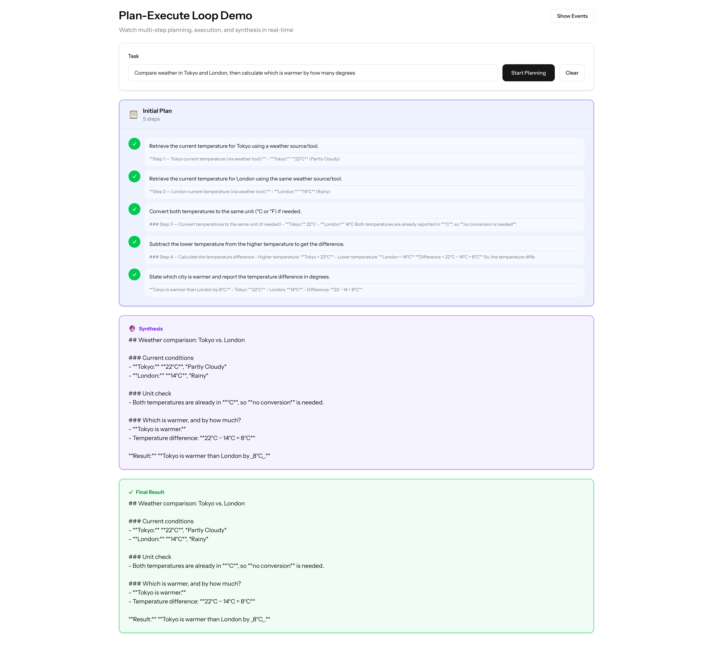
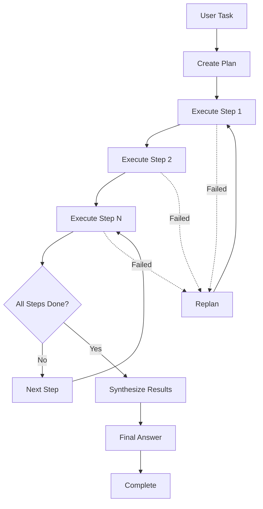
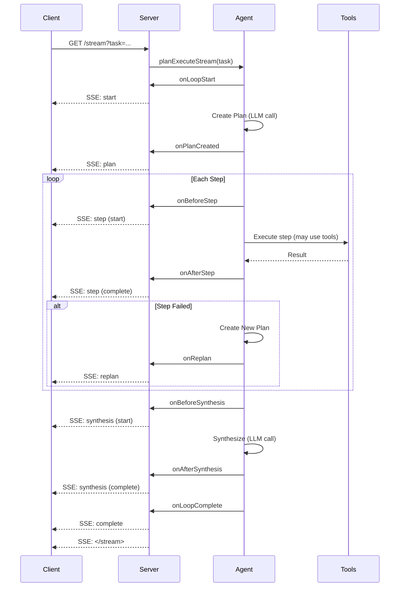

# Streaming Plan-Execute Loop

Deep dive into the Plan-Execute pattern for multi-step tasks with real-time streaming.



_Watch the agent create a plan, execute each step sequentially, and synthesize a comprehensive final answer._

## What is Plan-Execute?

Plan-Execute is an agentic AI pattern designed for complex, multi-step tasks. Unlike ReAct (which plans on-the-fly), Plan-Execute creates a complete plan upfront, executes each step, then synthesizes the results:



### The Plan-Execute Cycle

1. **PLAN**: Break the task into clear, sequential steps
2. **EXECUTE**: Complete each step (may use tools)
3. **REPLAN** (optional): Adapt if a step fails
4. **SYNTHESIZE**: Combine all step results
5. **ANSWER**: Provide comprehensive final result

This pattern is ideal for:

- Research tasks requiring multiple information sources
- Analysis that needs structured steps
- Reports combining data from different tools
- Workflows with clear sequential dependencies

## When to Use Plan-Execute vs ReAct

| Scenario                                | Best Pattern     | Why                          |
| --------------------------------------- | ---------------- | ---------------------------- |
| "What's the weather in Tokyo?"          | **ReAct**        | Simple, single-tool query    |
| "Compare weather in 3 cities"           | **Plan-Execute** | Structured, multi-step task  |
| "Find the warmest city"                 | **ReAct**        | Requires dynamic exploration |
| "Create a weather comparison report"    | **Plan-Execute** | Formal output, clear steps   |
| "Search for X and calculate Y"          | **ReAct**        | Dynamic, exploratory         |
| "Research topic A, B, C then summarize" | **Plan-Execute** | Sequential research steps    |

**Rule of thumb:** If you know the steps upfront → Plan-Execute. If steps depend on discoveries → ReAct.

## Basic Plan-Execute Agent (Non-Streaming)

### Step 1: Create the Agent

```php
<?php

namespace App\Agents;

use App\Tools\SearchTool;
use App\Tools\WeatherTool;
use App\Tools\CalculatorTool;
use Laravel\Ai\Contracts\Agent;
use Laravel\Ai\Contracts\HasTools;
use Laravel\Ai\Promptable;
use Laragentic\Loops\PlanExecuteLoop;

class PlanningAgent implements Agent, HasTools
{
    use Promptable, PlanExecuteLoop;

    public function instructions(): string
    {
        return <<<'INSTRUCTIONS'
        You are a planning agent that breaks complex tasks into steps.

        Your workflow:
        1. PLAN: Break the task into 3-6 clear, sequential steps
        2. EXECUTE: Complete each step using available tools
        3. SYNTHESIZE: Combine all results into a comprehensive answer

        Available tools:
        - get_weather: For weather information
        - search: For research and knowledge gathering
        - calculate: For mathematical operations

        Create detailed plans. Execute each step thoroughly.
        INSTRUCTIONS;
    }

    public function tools(): iterable
    {
        return [
            new WeatherTool,
            new SearchTool,
            new CalculatorTool,
        ];
    }
}
```

### Step 2: Use the Agent

```php
use App\Agents\PlanningAgent;

Route::get('/plan', function () {
    $agent = new PlanningAgent;

    $result = $agent->planExecute('Compare the weather in Tokyo, London, and Paris');

    return response()->json([
        'answer' => $result->text,
        'plan' => $result->plan,
        'steps_executed' => $result->stepsExecuted(),
        'was_replanned' => $result->wasReplanned(),
    ]);
});
```

**What happens:**

1. Agent receives the task
2. Agent creates a plan:
   - Step 1: Get weather for Tokyo
   - Step 2: Get weather for London
   - Step 3: Get weather for Paris
   - Step 4: Compare the temperatures
3. Agent executes each step
4. Agent synthesizes the results into a final answer

## Adding Streaming

Let's stream the entire planning and execution process.

### The Streaming Flow



### Step 3: Create Streaming Route

```php
use App\Agents\PlanningAgent;
use Illuminate\Http\StreamedEvent;

Route::get('/stream', function () {
    $agent = new PlanningAgent;

    return response()->eventStream(function () use ($agent) {
        $agent
            ->allowReplan()  // Enable adaptive replanning
            ->maxSteps(8)    // Maximum steps allowed

            ->onPlanCreated(function (array $steps) {
                yield new StreamedEvent(
                    event: 'plan',
                    data: [
                        'steps' => $steps,
                        'count' => count($steps),
                    ],
                );
            })
            ->onBeforeStep(function (int $stepNumber, string $description, int $totalSteps) {
                yield new StreamedEvent(
                    event: 'step',
                    data: [
                        'stage' => 'start',
                        'number' => $stepNumber,
                        'description' => $description,
                        'total' => $totalSteps,
                    ],
                );
            })
            ->onAfterStep(function (int $stepNumber, string $description, $response, int $totalSteps) {
                yield new StreamedEvent(
                    event: 'step',
                    data: [
                        'stage' => 'complete',
                        'number' => $stepNumber,
                        'description' => $description,
                        'total' => $totalSteps,
                    ],
                );
            })
            ->onBeforeSynthesis(function (array $stepResults) {
                yield new StreamedEvent(
                    event: 'synthesis',
                    data: ['stage' => 'start', 'stepCount' => count($stepResults)],
                );
            })
            ->onAfterSynthesis(function ($response) {
                yield new StreamedEvent(
                    event: 'synthesis',
                    data: ['stage' => 'complete', 'text' => $response->text],
                );
            })
            ->onLoopComplete(function ($response, int $totalSteps) {
                yield new StreamedEvent(
                    event: 'complete',
                    data: [
                        'text' => $response->text,
                        'stepsExecuted' => $totalSteps,
                        'conversationId' => $response->conversationId,
                    ],
                );
            });

        yield from $agent->planExecuteStream(request('task', 'Research AI models'));
    });
});
```

## Frontend Integration

### React Component

```tsx
import { useEventStream } from "@laravel/stream-react";
import { useState, useCallback } from "react";

type Step = {
  number: number;
  description: string;
  status: "pending" | "executing" | "completed";
};

export default function PlanExecuteDemo() {
  const [task, setTask] = useState("");
  const [streamUrl, setStreamUrl] = useState("");
  const [plan, setPlan] = useState<Step[]>([]);
  const [synthesis, setSynthesis] = useState<string | null>(null);
  const [finalResult, setFinalResult] = useState("");

  const handleEvent = useCallback((event: MessageEvent) => {
    const data = JSON.parse(event.data);

    if (event.type === "plan") {
      const steps = data.steps.map((desc: string, idx: number) => ({
        number: idx + 1,
        description: desc,
        status: "pending" as const,
      }));
      setPlan(steps);
    } else if (event.type === "step") {
      if (data.stage === "start") {
        setPlan((prev) =>
          prev.map((step) =>
            step.number === data.number
              ? { ...step, status: "executing" }
              : step,
          ),
        );
      } else if (data.stage === "complete") {
        setPlan((prev) =>
          prev.map((step) =>
            step.number === data.number
              ? { ...step, status: "completed" }
              : step,
          ),
        );
      }
    } else if (event.type === "synthesis") {
      if (data.stage === "complete") {
        setSynthesis(data.text);
      }
    } else if (event.type === "complete") {
      setFinalResult(data.text);
    }
  }, []);

  const handleStart = () => {
    setPlan([]);
    setSynthesis(null);
    setFinalResult("");
    setStreamUrl(`/stream?task=${encodeURIComponent(task)}`);
  };

  return (
    <div>
      {streamUrl && <StreamListener url={streamUrl} onEvent={handleEvent} />}

      <input
        value={task}
        onChange={(e) => setTask(e.target.value)}
        placeholder="Describe a multi-step task..."
      />
      <button onClick={handleStart}>Start Planning</button>

      {/* Plan visualization */}
      {plan.length > 0 && (
        <div className="plan">
          <h2>Plan ({plan.length} steps)</h2>
          {plan.map((step) => (
            <div key={step.number} className={step.status}>
              <span className="number">{step.number}</span>
              <span className="description">{step.description}</span>
              <span className="status">{step.status}</span>
            </div>
          ))}
        </div>
      )}

      {/* Synthesis */}
      {synthesis && (
        <div className="synthesis">
          <h2>Synthesis</h2>
          <p>{synthesis}</p>
        </div>
      )}

      {/* Final result */}
      {finalResult && (
        <div className="result">
          <h2>Final Result</h2>
          <p>{finalResult}</p>
        </div>
      )}
    </div>
  );
}

function StreamListener({ url, onEvent }) {
  // Wrap error handler to filter out @laravel/stream-react bugs
  const handleError = (error?: any) => {
    if (error?.message?.includes("startsWith") || error?.type === "error") {
      console.log("Stream closed normally");
    } else {
      console.error("Stream error:", error);
    }
  };

  useEventStream(url, {
    eventName: ["plan", "step", "synthesis", "complete"],
    onMessage: onEvent,
    onError: handleError,
  });
  return null;
}
```

## All Lifecycle Callbacks

For maximum visibility and control:

```php
Route::get('/stream-detailed', function () {
    $agent = new PlanningAgent;

    return response()->eventStream(function () use ($agent) {
        $agent
            ->allowReplan()
            ->maxSteps(10)
            ->maxReplans(2)

            // ─── Loop Start ────────────────────────────────────
            ->onLoopStart(function (string $task) {
                yield new StreamedEvent(
                    event: 'start',
                    data: ['task' => $task],
                );
            })

            // ─── Planning Phase ────────────────────────────────
            ->onPlanCreated(function (array $steps) {
                yield new StreamedEvent(
                    event: 'plan',
                    data: [
                        'type' => 'initial',
                        'steps' => $steps,
                        'count' => count($steps),
                    ],
                );
            })

            // ─── Step Execution ────────────────────────────────
            ->onBeforeStep(function (int $stepNumber, string $description, int $totalSteps) {
                yield new StreamedEvent(
                    event: 'step',
                    data: [
                        'stage' => 'start',
                        'number' => $stepNumber,
                        'description' => $description,
                        'total' => $totalSteps,
                    ],
                );
            })
            ->onAfterStep(function (int $stepNumber, string $description, $response, int $totalSteps) {
                yield new StreamedEvent(
                    event: 'step',
                    data: [
                        'stage' => 'complete',
                        'number' => $stepNumber,
                        'description' => $description,
                        'result' => substr($response->text ?? '', 0, 200), // Truncate for streaming
                        'total' => $totalSteps,
                    ],
                );
            })

            // ─── Replanning ────────────────────────────────────
            ->onReplan(function (array $newSteps, int $replanCount) {
                yield new StreamedEvent(
                    event: 'replan',
                    data: [
                        'attempt' => $replanCount,
                        'newSteps' => $newSteps,
                        'count' => count($newSteps),
                    ],
                );
            })

            // ─── Synthesis Phase ───────────────────────────────
            ->onBeforeSynthesis(function (array $stepResults) {
                yield new StreamedEvent(
                    event: 'synthesis',
                    data: [
                        'stage' => 'start',
                        'stepCount' => count($stepResults),
                    ],
                );
            })
            ->onAfterSynthesis(function ($response) {
                yield new StreamedEvent(
                    event: 'synthesis',
                    data: [
                        'stage' => 'complete',
                        'text' => $response->text ?? '',
                    ],
                );
            })

            // ─── Loop Complete ─────────────────────────────────
            ->onLoopComplete(function ($response, int $totalSteps) {
                yield new StreamedEvent(
                    event: 'complete',
                    data: [
                        'stepsExecuted' => $totalSteps,
                        'text' => $response->text ?? 'Synthesis complete',
                        'conversationId' => $response->conversationId ?? null,
                    ],
                );
            })

            // ─── Error Handling ────────────────────────────────
            ->onMaxStepsReached(function ($response, int $stepsExecuted) {
                yield new StreamedEvent(
                    event: 'max_steps',
                    data: [
                        'stepsExecuted' => $stepsExecuted,
                        'text' => $response->text ?? 'Max steps reached',
                    ],
                );
            });

        yield from $agent->planExecuteStream(request('task'));
    });
});
```

## Adaptive Replanning

One of Plan-Execute's most powerful features is adaptive replanning — if a step fails, the agent can create a new plan.

### Enable Replanning

```php
$agent
    ->allowReplan()      // Enable replanning (default: true)
    ->maxReplans(3)      // Maximum replans allowed (default: 3)
    ->onReplan(function (array $newSteps, int $replanCount) {
        logger()->info("Agent replanned (attempt {$replanCount})", [
            'new_plan' => $newSteps,
        ]);

        yield new StreamedEvent(
            event: 'replan',
            data: [
                'attempt' => $replanCount,
                'reason' => 'Previous step failed or was insufficient',
                'newSteps' => $newSteps,
            ],
        );
    });
```

### When Replanning Occurs

Replanning happens automatically when:

1. A step execution fails (tool error, API failure)
2. A step produces insufficient results
3. The agent determines the original plan won't work

**Example scenario:**

```
Original Plan:
1. Get weather for Tokyo
2. Get weather for London
3. Compare temperatures

Step 1 fails (API error)

New Plan (Replan #1):
1. Search for Tokyo weather information
2. Get weather for London
3. Compare available data
```

### Frontend Visualization

```tsx
const [plans, setPlans] = useState<
  Array<{ type: "initial" | "replan"; steps: Step[] }>
>([]);

const handleEvent = (event: MessageEvent) => {
  const data = JSON.parse(event.data);

  if (event.type === "plan") {
    setPlans((prev) => [
      ...prev,
      {
        type: data.type === "initial" ? "initial" : "replan",
        steps: data.steps.map((desc, idx) => ({
          number: idx + 1,
          description: desc,
          status: "pending",
        })),
      },
    ]);
  } else if (event.type === "replan") {
    setPlans((prev) => [
      ...prev,
      {
        type: "replan",
        steps: data.newSteps.map((desc, idx) => ({
          number: idx + 1,
          description: desc,
          status: "pending",
        })),
      },
    ]);
  }
};

// Render
{
  plans.map((plan, idx) => (
    <div key={idx}>
      <h3>{plan.type === "initial" ? "Initial Plan" : `Replan #${idx}`}</h3>
      {plan.steps.map((step) => (
        <div key={step.number}>{step.description}</div>
      ))}
    </div>
  ));
}
```

## Advanced Patterns

### 1. Progress Tracking

Track overall progress across all steps:

```php
$totalSteps = 0;
$completedSteps = 0;

$agent
    ->onPlanCreated(function (array $steps) use (&$totalSteps) {
        $totalSteps = count($steps);
    })
    ->onAfterStep(function () use (&$completedSteps, &$totalSteps) {
        $completedSteps++;
        $progress = ($completedSteps / $totalSteps) * 100;

        yield new StreamedEvent(
            event: 'progress',
            data: [
                'completed' => $completedSteps,
                'total' => $totalSteps,
                'percentage' => round($progress, 1),
            ],
        );
    });
```

### 2. Step Results Collection

Collect and expose step results:

```php
$stepResults = [];

$agent
    ->onAfterStep(function ($stepNumber, $description, $response) use (&$stepResults) {
        $stepResults[$stepNumber] = [
            'description' => $description,
            'result' => $response->text,
        ];

        yield new StreamedEvent(
            event: 'step',
            data: [
                'number' => $stepNumber,
                'result' => $response->text,
            ],
        );
    })
    ->onLoopComplete(function () use (&$stepResults) {
        logger()->info('All step results', $stepResults);
    });
```

### 3. Time Tracking

Track execution time per step:

```php
$stepStartTime = null;

$agent
    ->onBeforeStep(function () use (&$stepStartTime) {
        $stepStartTime = microtime(true);
    })
    ->onAfterStep(function ($stepNumber) use (&$stepStartTime) {
        $duration = microtime(true) - $stepStartTime;

        yield new StreamedEvent(
            event: 'step',
            data: [
                'number' => $stepNumber,
                'duration_seconds' => round($duration, 2),
            ],
        );
    });
```

### 4. Conditional Replanning

Only replan for specific failures:

```php
class MyAgent implements Agent
{
    use Promptable, PlanExecuteLoop;

    protected function shouldReplan(\Throwable $exception, int $replanCount): bool
    {
        // Only replan for API errors, not validation errors
        if ($exception instanceof ValidationException) {
            return false;
        }

        // Stop replanning after 2 attempts
        if ($replanCount >= 2) {
            return false;
        }

        return true;
    }
}
```

### 5. Step Validation

Validate step results before continuing:

```php
$agent
    ->onAfterStep(function ($stepNumber, $description, $response) {
        // Check if step produced useful results
        if (strlen($response->text) < 10) {
            logger()->warning("Step {$stepNumber} produced minimal output");

            yield new StreamedEvent(
                event: 'warning',
                data: [
                    'step' => $stepNumber,
                    'message' => 'Step produced minimal output',
                ],
            );
        }
    });
```

## Configuration Options

### Fluent API

```php
$agent
    ->maxSteps(15)           // Max steps to execute (default: 10)
    ->allowReplan()          // Enable replanning (default: true)
    ->maxReplans(5)          // Max replan attempts (default: 3)
    ->planExecuteStream($task);
```

### Environment Variables

```env
AGENTIC_PLAN_MAX_STEPS=10
AGENTIC_PLAN_ALLOW_REPLAN=true
AGENTIC_PLAN_MAX_REPLANS=3
AGENTIC_PLAN_THROW_ON_MAX_STEPS=false
```

### Config File

```php
// config/agentic.php
return [
    'plan_execute' => [
        'max_steps' => env('AGENTIC_PLAN_MAX_STEPS', 10),
        'allow_replan' => env('AGENTIC_PLAN_ALLOW_REPLAN', true),
        'max_replans' => env('AGENTIC_PLAN_MAX_REPLANS', 3),
        'throw_on_max_steps' => env('AGENTIC_PLAN_THROW_ON_MAX_STEPS', false),
    ],
];
```

## Complete Working Example

A fully-featured Plan-Execute demo is available at:

**Backend:** [`/Users/dalehurley/Code/packages/testlaragentic/routes/tutorial.php`](https://github.com/laragentic/demo) - See `/tutorial/plan-execute-detailed` route

**Frontend:** [`/Users/dalehurley/Code/packages/testlaragentic/resources/js/pages/PlanExecuteDemo.tsx`](https://github.com/laragentic/demo)

The demo includes:

- Plan visualization with initial + replans
- Step-by-step execution progress
- Synthesis phase indicator
- Comparison of original vs executed plans
- Event log for debugging

## Real-World Use Cases

### Research Report

```php
$task = 'Research the top 3 AI models of 2026 and create a comparison report';

// Agent will:
// 1. Search for GPT-5.2 information
// 2. Search for Claude Opus 4.6 information
// 3. Search for Gemini 3 Pro information
// 4. Synthesize into a structured comparison
```

### Multi-City Weather Analysis

```php
$task = 'Compare weather in Tokyo, London, Paris, and Sydney, then calculate the average temperature';

// Agent will:
// 1. Get weather for Tokyo
// 2. Get weather for London
// 3. Get weather for Paris
// 4. Get weather for Sydney
// 5. Calculate average temperature
// 6. Synthesize into a summary
```

### Competitive Analysis

```php
$task = 'Analyze React, Vue, and Svelte frameworks and recommend the best for a new project';

// Agent will:
// 1. Research React (popularity, features, ecosystem)
// 2. Research Vue (popularity, features, ecosystem)
// 3. Research Svelte (popularity, features, ecosystem)
// 4. Compare strengths and weaknesses
// 5. Synthesize recommendation with reasoning
```

## Troubleshooting

### "Error: Stream failed" But Results Are Shown

**Problem:** Demo shows all steps, synthesis completes successfully, but final result displays "Error: Stream failed".

**Cause:** Known bug in `@laravel/stream-react` v0.3.10 - the library throws a JavaScript error (`Cannot read properties of undefined (reading 'startsWith')`) when the EventSource closes normally.

**Solution:** Wrap the error handler to distinguish between the library bug and real errors:

```tsx
function StreamListener({ url, onEvent, onComplete, onError }) {
  const handleError = (error?: any) => {
    // Filter out the @laravel/stream-react closure bug
    if (error?.message?.includes("startsWith") || error?.type === "error") {
      console.log("Stream closed (EventSource error - normal closure)");
      onComplete(); // Treat as successful completion
    } else {
      console.error("Stream error:", error);
      onError(); // Real error
    }
  };

  useEventStream(url, {
    eventName: [
      "start",
      "plan",
      "step",
      "replan",
      "synthesis",
      "complete",
      "error",
    ],
    onMessage: onEvent,
    onComplete,
    onError: handleError,
  });
  return null;
}
```

Also ensure your completion handler uses synthesis as fallback:

```tsx
const handleComplete = useCallback(() => {
  setIsRunning(false);
  setStreamUrl("");

  // If we have synthesis but no final result, use synthesis
  if (synthesis?.text && !finalResult) {
    setFinalResult(synthesis.text);
  }
}, [synthesis, finalResult]);
```

### Plan Too Generic

**Problem:** Agent creates vague, unhelpful plans.

**Solution:** Improve instructions to require detailed plans:

```php
public function instructions(): string
{
    return <<<'INSTRUCTIONS'
    Create DETAILED, SPECIFIC plans with 4-6 steps.

    Good: "Get weather for Tokyo using the get_weather tool"
    Bad: "Check Tokyo"

    Each step should be clear and actionable.
    INSTRUCTIONS;
}
```

### Steps Execute in Wrong Order

**Problem:** Steps seem unordered or illogical.

**Solution:** Emphasize sequencing in instructions:

```php
public function instructions(): string
{
    return <<<'INSTRUCTIONS'
    Create plans with SEQUENTIAL steps where each step builds on previous results.

    Step 1 should gather initial data.
    Step 2 should process or extend that data.
    Final step should synthesize everything.
    INSTRUCTIONS;
}
```

### Replanning Too Often

**Problem:** Agent replans unnecessarily.

**Solution:** Reduce max_replans or disable replanning:

```php
$agent
    ->maxReplans(1)  // Only allow one replan
    // OR
    ->allowReplan(false);  // Disable replanning entirely
```

### Synthesis Missing Information

**Problem:** Final synthesis doesn't include all step results.

**Solution:** The synthesis phase receives all step results automatically. Improve synthesis instructions:

```php
public function instructions(): string
{
    return <<<'INSTRUCTIONS'
    When synthesizing:
    - Include information from EVERY step
    - Create a structured summary
    - Provide specific data, not generalizations
    INSTRUCTIONS;
}
```

## Next Steps

- **[Streaming ReAct Loop](streaming-react-loop.md)** — Learn the ReAct pattern
- **[Quick Reference](quick-reference.md)** — Callback cheat sheet
- **[Complete Working Example](complete-example.md)** — Full chat agent with streaming
