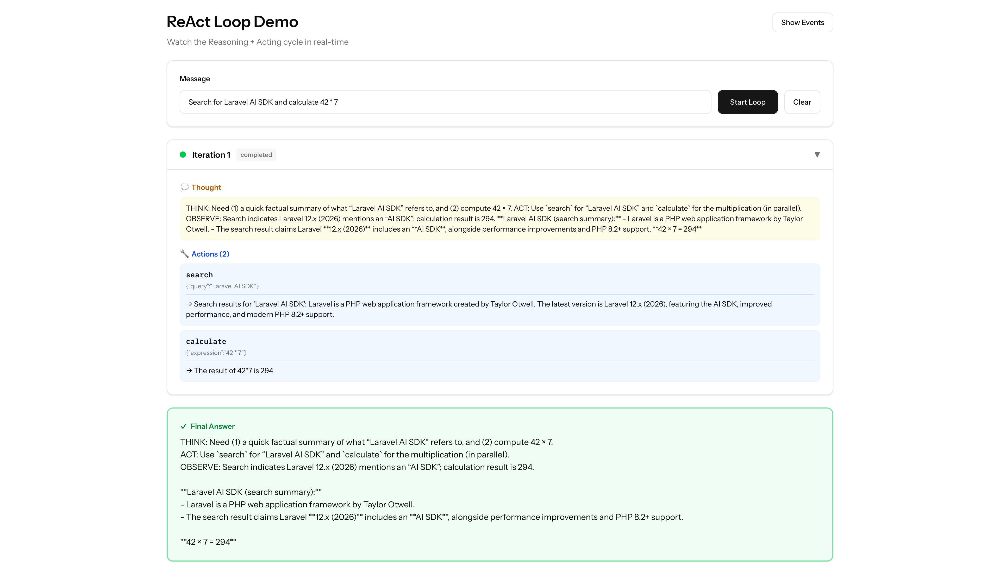
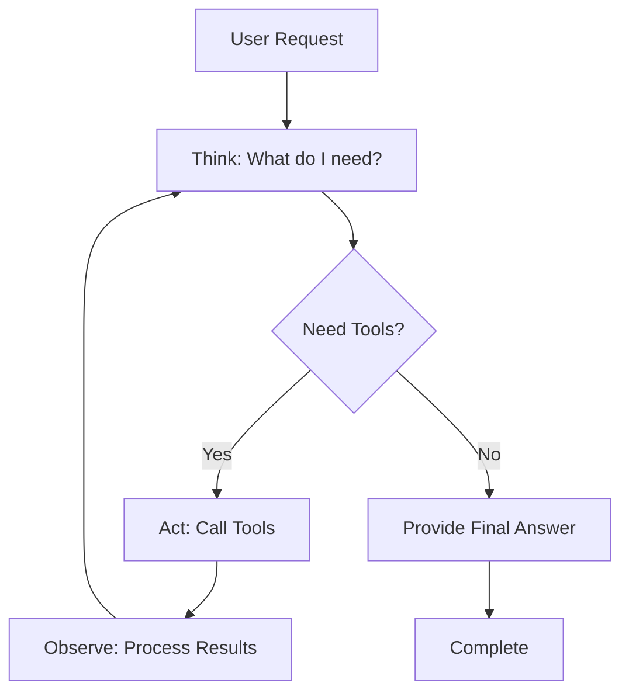
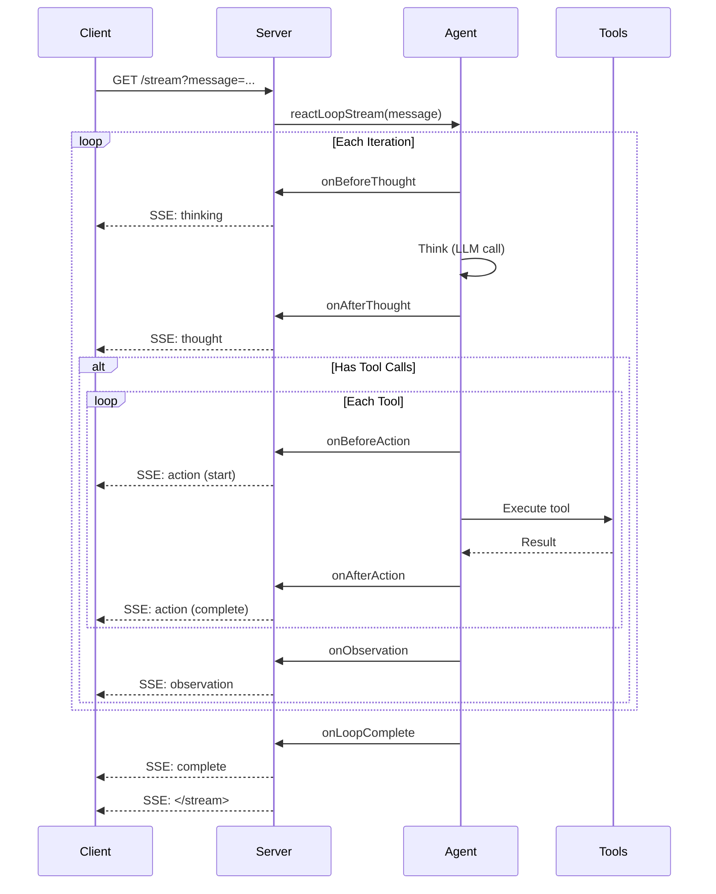

# Streaming ReAct Loop

Deep dive into the ReAct (Reasoning + Acting) loop pattern with real-time streaming.



*The agent autonomously searches, calculates, and synthesizes the answer — watch each iteration in real-time.*

## What is ReAct?

ReAct is an agentic AI pattern that combines **reasoning** (thinking about what to do) and **acting** (using tools to get information) in an iterative loop:



### The Loop Cycle

1. **THINK**: Agent reasons about the request
2. **ACT**: Agent calls one or more tools
3. **OBSERVE**: Agent processes tool results
4. **Repeat** until the agent has enough information to answer

This autonomous loop allows agents to make multiple tool calls, gather information iteratively, and provide comprehensive answers without explicit step-by-step instructions.

## Basic ReAct Agent (Non-Streaming)

Let's start simple — a ReAct agent without streaming:

### Step 1: Create the Agent

```php
<?php

namespace App\Agents;

use App\Tools\WeatherTool;
use App\Tools\CalculatorTool;
use Laravel\Ai\Contracts\Agent;
use Laravel\Ai\Contracts\HasTools;
use Laravel\Ai\Promptable;
use Laragentic\Loops\ReActLoop;

class SimpleReActAgent implements Agent, HasTools
{
    use Promptable, ReActLoop;

    public function instructions(): string
    {
        return <<<'INSTRUCTIONS'
        You are a helpful assistant. When asked a question:
        1. Think about what information you need
        2. Use the available tools to get that information
        3. Provide a clear answer based on the tool results
        
        Don't guess — use the tools!
        INSTRUCTIONS;
    }

    public function tools(): iterable
    {
        return [
            new WeatherTool,
            new CalculatorTool,
        ];
    }
}
```

### Step 2: Use the Agent

```php
use App\Agents\SimpleReActAgent;

Route::get('/simple', function () {
    $agent = new SimpleReActAgent;
    
    $result = $agent->reactLoop('What is the weather in Tokyo?');
    
    return response()->json([
        'answer' => $result->text,
        'iterations' => $result->iterations,
        'tool_calls' => $result->allToolCalls(),
    ]);
});
```

**What happens:**

1. Agent receives "What is the weather in Tokyo?"
2. Agent thinks: "I need to use the weather tool"
3. Agent calls `get_weather` with `city: Tokyo`
4. Agent observes the result
5. Agent provides final answer based on the weather data

All of this happens **automatically** inside `reactLoop()`.

## Adding Streaming

Now let's add real-time streaming so users see progress as it happens.

### The Streaming Flow



### Step 3: Create Streaming Route

```php
use App\Agents\SimpleReActAgent;
use Illuminate\Http\StreamedEvent;

Route::get('/stream', function () {
    $agent = new SimpleReActAgent;

    return response()->eventStream(function () use ($agent) {
        $agent
            ->onBeforeThought(function (string $prompt, int $iteration) {
                yield new StreamedEvent(
                    event: 'thinking',
                    data: ['iteration' => $iteration],
                );
            })
            ->onAfterAction(function (string $tool, array $args, string $result, int $iteration) {
                yield new StreamedEvent(
                    event: 'action',
                    data: [
                        'tool' => $tool,
                        'args' => $args,
                        'result' => $result,
                        'iteration' => $iteration,
                    ],
                );
            })
            ->onObservation(function (string $observation, int $iteration) {
                yield new StreamedEvent(
                    event: 'observation',
                    data: [
                        'text' => $observation,
                        'iteration' => $iteration,
                    ],
                );
            })
            ->onLoopComplete(function ($response, int $iterations) {
                yield new StreamedEvent(
                    event: 'complete',
                    data: [
                        'text' => $response->text,
                        'iterations' => $iterations,
                    ],
                );
            });

        // Start the streaming loop
        yield from $agent->reactLoopStream(request('message', 'Hello!'));
    });
});
```

**Key points:**

- Each callback `yield`s a `StreamedEvent`
- Events are sent to the client in real-time via SSE
- Use `yield from` to propagate the generator through the loop

## Frontend Integration

### React Component

```tsx
import { useEventStream } from '@laravel/stream-react';
import { useState, useCallback } from 'react';

export default function ReActDemo() {
    const [message, setMessage] = useState('');
    const [streamUrl, setStreamUrl] = useState('');
    const [iterations, setIterations] = useState([]);
    const [finalAnswer, setFinalAnswer] = useState('');

    const handleEvent = useCallback((event: MessageEvent) => {
        const data = JSON.parse(event.data);

        if (event.type === 'thinking') {
            setIterations(prev => [...prev, { 
                id: data.iteration, 
                status: 'thinking' 
            }]);
        } else if (event.type === 'action') {
            setIterations(prev => prev.map((iter, idx) => 
                idx === prev.length - 1 
                    ? { ...iter, action: data } 
                    : iter
            ));
        } else if (event.type === 'observation') {
            setIterations(prev => prev.map((iter, idx) => 
                idx === prev.length - 1 
                    ? { ...iter, observation: data.text } 
                    : iter
            ));
        } else if (event.type === 'complete') {
            setFinalAnswer(data.text);
        }
    }, []);

    const handleStart = () => {
        setIterations([]);
        setFinalAnswer('');
        setStreamUrl(`/stream?message=${encodeURIComponent(message)}`);
    };

    return (
        <div>
            {streamUrl && (
                <StreamListener 
                    url={streamUrl} 
                    onEvent={handleEvent} 
                />
            )}

            <input 
                value={message}
                onChange={e => setMessage(e.target.value)}
                placeholder="Ask a question..."
            />
            <button onClick={handleStart}>Ask</button>

            {/* Display iterations */}
            {iterations.map(iter => (
                <div key={iter.id}>
                    <h3>Iteration {iter.id}</h3>
                    {iter.status === 'thinking' && <p>🤔 Thinking...</p>}
                    {iter.action && (
                        <div>
                            <strong>Tool:</strong> {iter.action.tool}
                            <br />
                            <strong>Result:</strong> {iter.action.result}
                        </div>
                    )}
                    {iter.observation && <p>👁️ {iter.observation}</p>}
                </div>
            ))}

            {/* Final answer */}
            {finalAnswer && (
                <div className="final-answer">
                    <h2>Answer:</h2>
                    <p>{finalAnswer}</p>
                </div>
            )}
        </div>
    );
}

function StreamListener({ url, onEvent }) {
    // Wrap error handler to filter out @laravel/stream-react bugs
    const handleError = (error?: any) => {
        if (error?.message?.includes('startsWith') || error?.type === 'error') {
            console.log('Stream closed normally');
        } else {
            console.error('Stream error:', error);
        }
    };

    useEventStream(url, {
        eventName: ['thinking', 'action', 'observation', 'complete'],
        onMessage: onEvent,
        onError: handleError,
    });
    return null;
}
```

## All Lifecycle Callbacks

For maximum visibility, use all available callbacks:

```php
Route::get('/stream-detailed', function () {
    $agent = new SimpleReActAgent;

    return response()->eventStream(function () use ($agent) {
        $agent
            // ─── Loop Level ────────────────────────────────────
            ->onLoopStart(function (string $prompt) {
                yield new StreamedEvent(
                    event: 'start',
                    data: ['message' => $prompt],
                );
            })
            
            // ─── Iteration Level ───────────────────────────────
            ->onIterationStart(function (int $iteration) {
                yield new StreamedEvent(
                    event: 'iteration',
                    data: ['number' => $iteration, 'status' => 'started'],
                );
            })
            
            // ─── Thought Phase ─────────────────────────────────
            ->onBeforeThought(function (string $prompt, int $iteration) {
                yield new StreamedEvent(
                    event: 'thinking',
                    data: ['iteration' => $iteration],
                );
            })
            ->onAfterThought(function ($response, int $iteration) {
                yield new StreamedEvent(
                    event: 'thought',
                    data: [
                        'iteration' => $iteration,
                        'text' => $response->text,
                        'hasToolCalls' => $response->toolCalls->isNotEmpty(),
                        'toolCount' => $response->toolCalls->count(),
                    ],
                );
            })
            
            // ─── Action Phase ──────────────────────────────────
            ->onBeforeAction(function (string $tool, array $args, int $iteration) {
                yield new StreamedEvent(
                    event: 'action',
                    data: [
                        'tool' => $tool,
                        'args' => $args,
                        'iteration' => $iteration,
                        'stage' => 'start',
                    ],
                );
            })
            ->onAfterAction(function (string $tool, array $args, string $result, int $iteration) {
                yield new StreamedEvent(
                    event: 'action',
                    data: [
                        'tool' => $tool,
                        'result' => $result,
                        'iteration' => $iteration,
                        'stage' => 'complete',
                    ],
                );
            })
            
            // ─── Observation Phase ─────────────────────────────
            ->onObservation(function (string $observation, int $iteration) {
                yield new StreamedEvent(
                    event: 'observation',
                    data: [
                        'text' => $observation,
                        'iteration' => $iteration,
                    ],
                );
            })
            
            // ─── Iteration End ─────────────────────────────────
            ->onIterationEnd(function (int $iteration) {
                yield new StreamedEvent(
                    event: 'iteration',
                    data: ['number' => $iteration, 'status' => 'completed'],
                );
            })
            
            // ─── Loop Complete ─────────────────────────────────
            ->onLoopComplete(function ($response, int $iterations) {
                yield new StreamedEvent(
                    event: 'complete',
                    data: [
                        'text' => $response->text,
                        'iterations' => $iterations,
                        'conversationId' => $response->conversationId ?? null,
                    ],
                );
            })
            
            // ─── Error Handling ────────────────────────────────
            ->onMaxIterationsReached(function ($response, int $iterations) {
                yield new StreamedEvent(
                    event: 'max_iterations',
                    data: [
                        'iterations' => $iterations,
                        'text' => $response?->text ?? 'Max iterations reached',
                    ],
                );
            });

        yield from $agent->reactLoopStream(request('message'));
    });
});
```

## Advanced Patterns

### 1. Custom Observation Formatting

By default, tool results are formatted like:

```
Tool get_weather returned: Weather in Tokyo: Sunny, 22°C
Tool calculate returned: The result of 2+2 is 4
```

You can customize this:

```php
class MyAgent implements Agent
{
    use Promptable, ReActLoop;

    protected function formatObservation(Collection $toolCalls): string
    {
        if ($toolCalls->count() === 1) {
            $call = $toolCalls->first();
            return "Result: {$call->result}";
        }

        $formatted = $toolCalls->map(function ($call) {
            return "- {$call->name}: {$call->result}";
        })->implode("\n");

        return "Multiple results:\n{$formatted}";
    }
}
```

### 2. Early Termination

Stop the loop early based on custom logic:

```php
class MyAgent implements Agent
{
    use Promptable, ReActLoop;

    protected function loopShouldTerminate(AgentResponse $response): bool
    {
        // Stop if agent explicitly says "FINAL ANSWER:"
        if (str_contains($response->text, 'FINAL ANSWER:')) {
            return true;
        }

        // Stop if no tool calls (default behavior)
        if ($response->toolCalls->isEmpty()) {
            return true;
        }

        return false;
    }
}
```

### 3. Progress Broadcasting

Broadcast progress to multiple clients via WebSockets:

```php
$agent
    ->onAfterAction(function ($tool, $args, $result, $iteration) use ($userId) {
        // Stream to HTTP client
        yield new StreamedEvent(
            event: 'action',
            data: compact('tool', 'result', 'iteration')
        );

        // Also broadcast to WebSocket subscribers
        broadcast(new AgentProgress($userId, [
            'type' => 'action',
            'tool' => $tool,
            'result' => $result,
        ]));
    });
```

### 4. Conditional Callbacks

Only fire callbacks for specific tools:

```php
$agent
    ->onAfterAction(function ($tool, $args, $result, $iteration) {
        // Only stream expensive API calls
        if (in_array($tool, ['search_web', 'fetch_url'])) {
            yield new StreamedEvent(
                event: 'action',
                data: compact('tool', 'result')
            );
        }
    });
```

### 5. Tracking Costs

Track API usage and costs:

```php
$totalCost = 0;

$agent
    ->onAfterThought(function ($response) use (&$totalCost) {
        // Track token usage
        $inputTokens = $response->usage['input_tokens'] ?? 0;
        $outputTokens = $response->usage['output_tokens'] ?? 0;
        
        // Calculate cost (example for Claude Opus)
        $cost = ($inputTokens / 1_000_000 * 5) + ($outputTokens / 1_000_000 * 25);
        $totalCost += $cost;
    })
    ->onLoopComplete(function () use (&$totalCost) {
        logger()->info("Total cost: $" . number_format($totalCost, 4));
    });
```

## Max Iterations Handling

Configure and handle iteration limits:

```php
$agent
    ->maxIterations(15) // Override default (10)
    ->onMaxIterationsReached(function ($response, int $iterations) {
        logger()->warning("Agent hit max iterations", [
            'iterations' => $iterations,
            'partial_response' => $response?->text,
        ]);

        yield new StreamedEvent(
            event: 'max_iterations',
            data: [
                'message' => 'Task took too long. Stopped after ' . $iterations . ' iterations.',
                'partial_result' => $response?->text,
            ],
        );
    });

yield from $agent->reactLoopStream('Complex multi-step task...');
```

**Frontend handling:**

```tsx
const handleEvent = (event) => {
    if (event.type === 'max_iterations') {
        const data = JSON.parse(event.data);
        alert(data.message);
        // Show partial result if available
        if (data.partial_result) {
            setAnswer(data.partial_result);
        }
    }
};
```

## Complete Working Example

A fully-featured ReAct demo is available at:

**Backend:** [`/Users/dalehurley/Code/packages/testlaragentic/routes/tutorial.php`](https://github.com/laragentic/demo) - See `/tutorial/react-loop-detailed` route

**Frontend:** [`/Users/dalehurley/Code/packages/testlaragentic/resources/js/pages/ReactLoopDemo.tsx`](https://github.com/laragentic/demo)

The demo includes:

- Full iteration timeline with expandable cards
- Real-time thought/action/observation display
- Visual progress indicators
- Event log for debugging
- Max iterations handling

## Comparison: ReAct vs Plan-Execute

| Feature | ReAct Loop | Plan-Execute Loop |
|---------|-----------|-------------------|
| **Use Case** | Dynamic, exploratory tasks | Structured, multi-step tasks |
| **Planning** | Implicit (agent decides per iteration) | Explicit (creates plan upfront) |
| **Tool Calls** | Multiple per iteration | Typically one per step |
| **Flexibility** | High (adapts each iteration) | Medium (follows plan, can replan) |
| **Visibility** | See reasoning at each step | See entire plan upfront |
| **Best For** | Q&A, research, investigation | Reports, analysis, workflows |

**Example tasks:**

- **ReAct**: "What's the weather in the warmest city: Tokyo, London, or Paris?"
- **Plan-Execute**: "Create a comparison report of Tokyo, London, and Paris weather"

## Troubleshooting

### "Error: Stream failed" After Results Display

**Problem:** Loop completes, final answer shows correctly, but then "Stream failed" error appears.

**Cause:** Known bug in `@laravel/stream-react` v0.3.10 - throws error when EventSource closes.

**Solution:** Add error handler wrapper in StreamListener component:

```tsx
const handleError = (error?: any) => {
    // Known library bug: throws on normal closure
    if (error?.message?.includes('startsWith') || error?.type === 'error') {
        console.log('Stream closed normally');
        onComplete(); // Treat as success
    } else {
        console.error('Stream error:', error);
        onError(); // Real error
    }
};

useEventStream(url, {
    eventName: ['thinking', 'action', 'observation', 'complete', 'error'],
    onMessage: onEvent,
    onComplete,
    onError: handleError,
});
```

### Agent Loops Too Many Times

**Problem:** Agent keeps calling tools unnecessarily.

**Solution:** Improve instructions to indicate when to stop:

```php
public function instructions(): string
{
    return <<<'INSTRUCTIONS'
    Use tools to gather information, then provide a FINAL answer.
    
    When you have enough information, respond with your answer.
    Do NOT call tools again after you have the data you need.
    INSTRUCTIONS;
}
```

### No Tool Calls Happening

**Problem:** Agent not using tools.

**Solution:** Make tool usage explicit in instructions:

```php
public function instructions(): string
{
    return <<<'INSTRUCTIONS'
    You MUST use the available tools. Do not guess or make up information.
    
    For weather: ALWAYS use get_weather tool
    For calculations: ALWAYS use calculate tool
    INSTRUCTIONS;
}
```

### Slow Streaming

**Problem:** Events arrive in bursts instead of real-time.

**Solution:** Disable output buffering:

```php
Route::get('/stream', function () {
    ini_set('output_buffering', 'off');
    ini_set('zlib.output_compression', 'off');
    
    return response()->eventStream(/* ... */);
});
```

## Next Steps

- **[Streaming Plan-Execute Loop](streaming-plan-execute-loop.md)** — Learn the Plan-Execute pattern
- **[Quick Reference](quick-reference.md)** — Callback cheat sheet
- **[Complete Working Example](complete-example.md)** — Full chat agent with streaming
